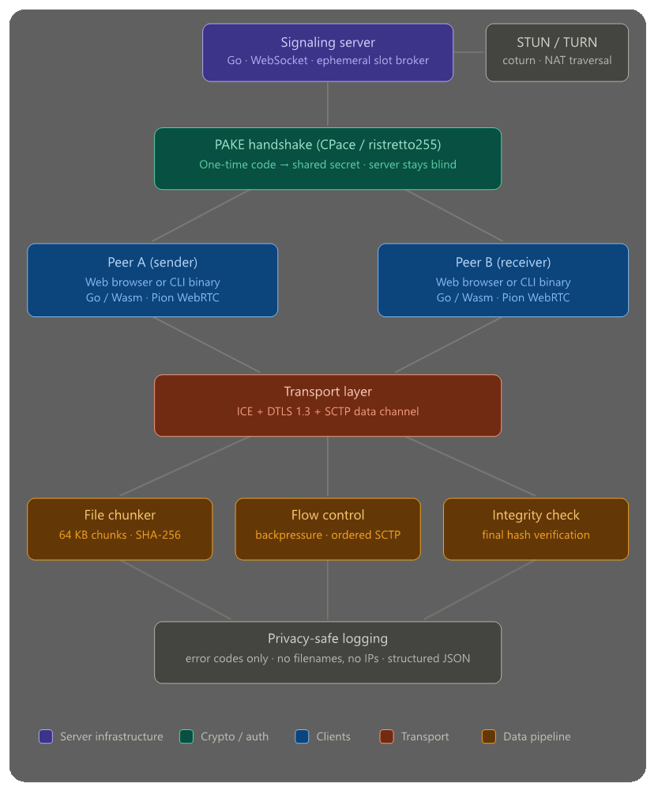

<p align="center">
  
</p>

# gmmff — peer-to-peer file transfer

> **gmmff** (pronounced *gimph*) is a brutally simple, cryptographically sound
> peer-to-peer file and message transfer system.

gmmff consists of two parts: a **signaling server** that brokers the initial
connection, and a **CLI client** that handles the actual transfer.  The server
never sees file contents — once two peers are connected, all data flows
directly between them over an encrypted WebRTC data channel.

---

## Quick start

### Starting a file session

Machine A creates the session and gets a code:

```bash
gmmff create --server wss://your-server/ws
```

```
  ╔══════════════════════════════════════╗
  ║  Share this code with the other side ║
  ║                                      ║
  ║    acid-lake-drum                    ║
  ║                                      ║
  ║  Expires in 10 minutes               ║
  ╚══════════════════════════════════════╝

  Run on the other machine:
    gmmff join acid-lake-drum
```

Machine B joins the session:

```bash
gmmff join acid-lake-drum --server wss://your-server/ws
```

Once connected, both sides drop into the session REPL:

```
Session ready. Commands:
  send <file|dir> [file|dir ...]   send file(s) to peer
  message <text>                   send a text message
  chat                             open interactive chat sub-session
  \q                               end session for everyone (initiator only)
```

### Sending files in a session

```bash
> send report.pdf
> send notes.txt data.csv
> send ./project-folder
```

A single file is sent as-is. Multiple files or a directory are zipped on the
fly — the receiver gets one `.zip` archive.

### Sending a message in a session

```bash
> message "Here is the Q3 report, let me know if you have questions"
```

Messages appear instantly on the other terminal. Optionally, with a single
file transfer the message is printed before the file saves; with multiple
files it is injected as `message.txt` inside the zip.

### Opening a chat sub-session

```bash
> chat
chat> Hello! Ready to transfer?
chat> \q
Returning to session.
>
```

Type `\q` inside `chat` to return to the session REPL without ending the session.

### Session control

| Who | Action | Effect |
|-----|--------|--------|
| Initiator | `\q` | Ends the session for everyone |
| Initiator | `Ctrl+C` | Leaves quietly; session stays open |
| Responder | `\q` or `Ctrl+C` | Leaves quietly; session stays open |

### Multi-peer sessions

By default, sessions allow 2 participants. Use `--max-peers` to allow up to 10:

```bash
# Allow up to 5 participants
gmmff create --max-peers 5 --server wss://your-server/ws
```

Share the same code with up to 4 other people — they all `gmmff join` the same code.

**Transfer rules by participant count:**

| Session size | File transfers | Chat messages |
|-------------|---------------|---------------|
| 2 peers | Either side can send (bidirectional) | Either side |
| 3–10 peers | Initiator only (broadcast to all) | Any participant |

The initiator is the hub — all file transfers flow through them. If a peer leaves mid-transfer, their transfer ends but all other peers continue receiving. A session slot never reopens once it has been fully filled.

The session closes automatically after 10 minutes of inactivity. Any file
transfer or message resets the timer.

---

### Starting a pure chat session (CLI)

For a text-only session without file transfer, use `gmmff chat`:

```bash
# Machine A
gmmff chat --server wss://your-server/ws

# Machine B — gmmff join detects the session type and routes to the chat REPL
gmmff join river-stone-fog --server wss://your-server/ws
```

---

### Files tab (browser UI)

Open the **Files** tab, click **Start session** to get a code, or click
**Join with a code** to enter one. Once connected:

- Set **Max participants** (2–10) before starting — 2 is bidirectional, 3–10 makes the initiator the broadcaster
- Drag and drop files anywhere on the page, or use **Choose files** / **Choose folder**
- Click **Send** to transfer — the other side auto-downloads once verified
- Type in the message box to send a text message
- **End session** leaves quietly; typing `\q` ends for everyone (initiator) or leaves quietly (responder)

A progress bar appears per transfer. Queued transfers each get their own bar.

### Chat tab (browser UI)

Open the **Chat** tab, click **Start session** to get a code, or click
**Join with a code** to enter one. Type `\q` in the message box to end the
session (initiator) or leave quietly (responder). The **End session** button
always leaves quietly.

---

## Commands

### `gmmff create` — start a file + message session

```
Usage: gmmff create [flags]
```

| Flag | Env var | Default | Description |
|------|---------|---------|-------------|
| `--server` | `GMMFF_SERVER` | `ws://localhost:8080/ws` | Signaling server WebSocket URL |
| `--stun` | `GMMFF_STUN` | Google STUN | STUN/STUNS URL, repeatable |
| `--turn` | `GMMFF_TURN` | — | TURN server, repeatable (see TURN section) |
| `--out` / `-o` | — | `.` | Directory to save received files |
| `--max-peers` | — | `2` | Maximum participants including yourself (2–10) |

### `gmmff join <code>` — join any session

```
Usage: gmmff join <code> [flags]
```

Detects the session type from the server automatically — routes to the file
session REPL for `files` sessions, or the chat REPL for `chat` sessions.

| Flag | Env var | Default | Description |
|------|---------|---------|-------------|
| `--server` | `GMMFF_SERVER` | `ws://localhost:8080/ws` | Signaling server WebSocket URL |
| `--stun` | `GMMFF_STUN` | Google STUN | STUN/STUNS URL, repeatable |
| `--turn` | `GMMFF_TURN` | — | TURN server, repeatable |

### `gmmff chat` — start a pure text chat session

```
Usage: gmmff chat [flags]
```

| Flag | Env var | Default | Description |
|------|---------|---------|-------------|
| `--server` | `GMMFF_SERVER` | `ws://localhost:8080/ws` | Signaling server WebSocket URL |
| `--stun` | `GMMFF_STUN` | Google STUN | STUN/STUNS URL, repeatable |
| `--turn` | `GMMFF_TURN` | — | TURN server, repeatable |

---

## Environment variables

Set these to avoid passing flags on every command:

```bash
export GMMFF_SERVER=wss://your-server/ws
gmmff create
```

| Variable | Used by | Description |
|----------|---------|-------------|
| `GMMFF_SERVER` | all client commands | Signaling server WebSocket URL |
| `GMMFF_STUN` | all client commands | Comma-separated STUN/STUNS URLs |
| `GMMFF_TURN` | all client commands | Comma-separated TURN URLs (Option A format) |

---

## STUN configuration

`--stun` is repeatable. User-supplied servers **append** to the default Google
STUN server — the default is always present as a baseline.

```bash
# Add one more STUN server alongside the default
gmmff create --stun stun:mystun.example.com:3478

# Add two more
gmmff create \
  --stun stun:stun1.example.com:3478 \
  --stun stuns:stun2.example.com:5349

# Via environment variable (comma-separated)
export GMMFF_STUN=stun:stun1.example.com:3478,stuns:stun2.example.com:5349
```

---

## TURN configuration

TURN servers are specified in a single string with auth embedded as query
parameters. Maximum 3 TURN servers. Mixing auth types across servers is
fully supported.

### URL format

```
turn:host:port[?transport=udp|tcp][&user=u&pass=p]
turn:host:port[?transport=udp|tcp][&secret=s]
turns:host:port[?transport=tcp][&user=u&pass=p]
turns:host:port[?transport=tcp][&secret=s]
```

### Long-term credentials (username + password)

```bash
gmmff create --turn "turn:turn.example.com:3478?user=alice&pass=s3cr3t"

# With transport hint and TLS
gmmff create --turn "turns:turn.example.com:5349?transport=tcp&user=alice&pass=s3cr3t"
```

### Ephemeral credentials (coturn static-auth-secret)

Credentials are derived via RFC 8489 §9.2 (HMAC-SHA1) and expire after 24 hours.

```bash
gmmff create --turn "turn:turn.example.com:3478?transport=udp&secret=mystaticsecret"
```

### Mixed auth types across servers

```bash
# Local ephemeral (UDP) + remote long-term (TCP/TLS)
gmmff create \
  --turn "turn:local.host:3478?transport=udp&secret=abc" \
  --turn "turns:paid.host:5349?transport=tcp&user=alice&pass=xyz"
```

### Via environment variable

```bash
export GMMFF_TURN="turn:local.host:3478?transport=udp&secret=abc,turns:paid.host:5349?user=alice&pass=xyz"
```

### Transport parameter

| Value | When to use |
|-------|-------------|
| `transport=udp` | Prefer UDP — lower latency, works in most networks |
| `transport=tcp` | Prefer TCP — better through strict firewalls |
| *(omitted)* | coturn tries both automatically |
| `turns:` scheme | Always TLS/TCP — `transport=tcp` implied |

### TURN validation errors

```
turn: too many servers — maximum is 3, got 4
turn: "turn:host:port" has no credentials — provide user+pass or secret
turn: "turn:host:port" has user or pass but not both
turn: turns: scheme requires TCP/TLS — transport=udp is not valid
turn: URL must begin with turn: or turns:
```

---

## How it works

```
Peer A ──┐                          ┌── Peer B
         │  wss://host/ws           │
         └──── Signaling server ────┘
                    │
               Redis (slot state)
```

<p align="center">
  
</p>

1. Peer A runs `gmmff create` and receives a one-time 3-word code
2. Peer A shares that code out-of-band with Peer B
3. Peer B runs `gmmff join <code>` on any machine, anywhere
4. CPace PAKE authenticates both sides — the signaling server stays blind
5. The SDP offer/answer is HMAC-signed with the PAKE shared key, preventing man-in-the-middle substitution
6. A direct WebRTC/DTLS control channel opens; the signaling server's job is done
7. Both peers enter the session REPL and can freely exchange files and messages

| Phase | What the server does |
|-------|----------------------|
| `slot.create`  | Generates a UUID + 3-word code, persists in Redis with 10-min TTL |
| `slot.join`    | Resolves code → slot, links the responder, sends `slot.ready` to both |
| Relay          | Forwards `pake.*`, `sdp.*`, `ice.*` frames opaquely to the other peer |
| `bye` / expire | Deletes both Redis keys; notifies peer |

The server **cannot** intercept the session.  PAKE authentication happens
entirely between the two clients, and the DTLS session key is bound to the
PAKE shared secret via HMAC — so a compromised signaling server cannot
substitute its own SDP fingerprints.

---

## Running the signaling server

### Option A — Docker Compose (recommended)

```bash
git clone https://github.com/iamdoubz/gmmff
cd gmmff
docker compose up
# Server available at ws://localhost:8080/ws
```

### Option B — Local Go + Redis

Prerequisites: **Go 1.23+**, **Redis 7+**

```bash
# Start Redis
redis-server

# Run with in-memory store (no Redis needed for dev)
go run ./cmd/gmmff serve --memory --log-pretty --log-level debug

# Or with Redis
go run ./cmd/gmmff serve --log-pretty --log-level debug
```

### Verify

```bash
curl http://localhost:8080/healthz   # → ok
curl http://localhost:8080/readyz    # → ok (or 503 if Redis is down)
curl http://localhost:8080/metrics   # → JSON counters
```

---

## Server configuration

All flags have environment variable equivalents with the `GMMFF_` prefix.
Copy `configs/.env.example` to `.env` and adjust.

| Flag | Env var | Default | Description |
|------|---------|---------|-------------|
| `--addr` | `GMMFF_ADDR` | `:8080` | Listen address |
| `--redis-url` | `GMMFF_REDIS_URL` | `redis://localhost:6379/0` | Redis URL |
| `--memory` | — | `false` | Use in-memory store (dev only) |
| `--log-level` | `GMMFF_LOG_LEVEL` | `info` | `trace\|debug\|info\|warn\|error` |
| `--log-pretty` | — | `false` | Human-readable logs |
| `--slot-ttl` | — | `10m` | Slot expiry duration |
| `--tls-cert` | `GMMFF_TLS_CERT` | — | TLS certificate path |
| `--tls-key` | `GMMFF_TLS_KEY` | — | TLS private key path |
| `--web` | `GMMFF_WEB_DIR` | — | Path to `web/static/` — serves browser UI at `/` alongside signaling |
| `--csp-report-only` | — | `false` | Use `CSP-Report-Only` header for debugging — **NOT for production** |

**Production TLS**: use a reverse proxy (Caddy, nginx, AWS ALB).  The server
speaks plain HTTP internally; the proxy handles TLS termination and forwards
`wss://` connections.

---

## Browser UI (Wasm)

The same Go code that powers the CLI compiles to WebAssembly and runs directly
in the browser — one codebase, two delivery targets.

### Build

**Note**: this is for go 1.23 and lower

```bash
make wasm
# Outputs: web/static/gmmff.wasm + web/static/wasm_exec.js
```

Or manually for go <= 1.23:

```bash
GOOS=js GOARCH=wasm go build -o web/static/gmmff.wasm ./web/cmd/gmmff-wasm
cp "$(go env GOROOT)/misc/wasm/wasm_exec.js" web/static/wasm_exec.js
```

Or manually for go > 1.23:

```bash
GOOS=js GOARCH=wasm go build -o web/static/gmmff.wasm ./web/cmd/gmmff-wasm
cp "$(go env GOROOT)/lib/wasm/wasm_exec.js" web/static/wasm_exec.js
```

### Run locally

```bash
make wasm-serve
# → http://localhost:9000
```

### Deploy

Copy `web/static/` to any static host (S3, Cloudflare Pages, nginx `root`).
The `gmmff.wasm` file is typically 8–15 MB — serve it with `Content-Type: application/wasm`
and gzip/brotli compression enabled for fast first-load.

### Theming

Copy `web/static/themes/default.json`, edit the values, and point the `THEME_URL`
constant at the top of `app.js` at your new file. Every CSS custom property
is overridable — colors, spacing, radii, fonts, max-width — with no build step required.

### Translations

The UI ships with 10 languages: English, Spanish, French, German, Italian,
Swedish, Brazilian Portuguese, European Portuguese, Tamil, and Sinhala. The
language picker in the footer auto-detects your browser preference and
persists your choice for 7 days.

To add a language: copy `web/static/i18n/en.json`, translate the values, save
as `web/static/i18n/<code>.json`, and add an entry to `web/static/i18n/languages.json`.
No build step required.

### ICE settings

A collapsible **ICE servers** panel sits below the tab bar, shared across all
tabs. STUN servers you add are appended to the default. TURN servers use the
same Option A format as the CLI (`turn:host:port?transport=udp&secret=s`).
Settings persist in `localStorage` for 7 days.

---

## Deployment

For production deployments, see the dedicated guides in the `docs/` directory:

- **[docs/SYSTEMD.md](docs/SYSTEMD.md)** — Creating a dedicated system user, installing the binary and service file, managing configuration without editing the service file, and Redis Unix socket access.

- **[docs/NGINX.md](docs/NGINX.md)** — Configuring nginx as a reverse proxy with TLS termination, WebSocket upgrade headers, timeout tuning, and endpoint access control.

---

## Security model

### CPace PAKE
Both peers authenticate using CPace over the ristretto255 group
(`filippo.io/cpace`).  The signaling server forwards PAKE messages opaquely
and never learns the shared secret.

### SDP MAC binding (zero-trust signaling)
After the PAKE handshake, two subkeys are derived from the shared secret using
HKDF-SHA256:

```
offerKey  = HKDF(sharedKey, salt="gmmff-v1", info="sdp-offer-mac")
answerKey = HKDF(sharedKey, salt="gmmff-v1", info="sdp-answer-mac")
```

The initiator HMAC-signs the SDP offer with `offerKey` before sending it to
the relay.  The responder verifies the MAC before calling `SetRemoteDescription`
— and vice versa for the answer.  A compromised signaling server cannot
substitute its own SDP fingerprints because it does not know the shared key.

### DTLS 1.3
All data channel traffic is encrypted end-to-end by Pion's DTLS 1.3
implementation.  The signaling server is out of the loop once ICE completes.

### Resumable transfers
Partial files are written as `<name>.gmmff_partial` with a `<name>.gmmff_meta`
sidecar (SHA256 + chunk size + bytes written).  On resume, the receiver
replays the partial file through SHA-256 to reconstruct the running hash and
sends a `ResumeFrom` frame to the sender.  Both progress bars advance to the
correct offset before transfer continues.  On completion, both temp files are
deleted and the final file is renamed into place.

---

## Wire protocol

All signaling messages are JSON `{ "type": "...", "payload": { ... } }`.

### Slot creation

```
Client → Server:   { "type": "slot.create", "payload": { "protocol_version": "1", "session_type": "files|chat" } }
Server → Client:   { "type": "slot.created", "payload": { "slot_id": "...", "code": "word-word-word", "ttl_seconds": 600, "session_type": "files|chat" } }
```

### Slot join

```
Client → Server:   { "type": "slot.join", "payload": { "code": "word-word-word", "protocol_version": "1" } }
Server → both:     { "type": "slot.ready", "payload": { "role": "initiator|responder", "session_type": "files|chat" } }
```

The `session_type` in `slot.ready` lets `gmmff join` route automatically to
the correct REPL without the user needing to know what kind of session they
are joining.

### PAKE relay (opaque)

```
Client → Server:   { "type": "pake.a", "payload": { "data": "<base64>" } }
Server → peer:     { "type": "pake.a", "payload": { "data": "<base64>" } }
```

The same opaque relay applies to `pake.b`.  The server never decodes these.

### Signed SDP

```
Client → Server:   { "type": "sdp.offer", "payload": { "sdp": "<base64>", "mac": "<base64>" } }
Server → peer:     { "type": "sdp.offer", "payload": { "sdp": "<base64>", "mac": "<base64>" } }
```

`sdp` is the base64-encoded WebRTC `SessionDescription` JSON.  `mac` is the
base64-encoded HMAC-SHA256 over the raw SDP bytes, computed with the
appropriate HKDF subkey.  The same structure applies to `sdp.answer`.

### Data channel binary tags

Once a WebRTC data channel opens, all frames are binary with a one-byte tag
prefix. Sessions use two kinds of channels: a persistent **control channel**
and ephemeral **transfer channels** (one opened per file, named
`transfer-<timestamp>`).

| Tag | Direction | Channel | Meaning |
|-----|-----------|---------|---------|
| `0x01` | sender → receiver | transfer | File header (JSON: name, size, SHA-256, chunk count, optional message) |
| `0x02` | sender → receiver | transfer | Chunk (8-byte seq + payload) |
| `0x03` | receiver → sender | transfer | Chunk ack (8-byte seq) |
| `0x04` | sender → receiver | transfer | Transfer done |
| `0x05` | receiver → sender | transfer | Transfer OK (hash verified) |
| `0x06` | either direction | transfer | Transfer error |
| `0x07` | receiver → sender | transfer | Resume from chunk N (8-byte seq) |
| `0x08` | either direction | either | Cancelled |
| `0x09` | either direction | control | Chat / session message (UTF-8 text) |
| `0x0A` | initiator → all | control | Chat close — ends chat session for everyone |
| `0x0B` | any participant | control | Participant leave — quiet exit; session continues |
| `0x0C` | either direction | control | Session ready |
| `0x0D` | sender → receiver | control | Transfer announce (channel label) |
| `0x0E` | receiver → sender | control | Transfer accepted (channel label) |
| `0x0F` | initiator → all | control | Session close — ends file session for everyone |

### Error frames

```json
{ "type": "error", "payload": { "code": "ERR_SLOT_NOT_FOUND", "message": "slot not found..." } }
```

Error codes contain no user-identifying information and are safe to include
in bug reports.

---

## Privacy & logging

Logs contain **only**:

- Timestamp
- Component name (`broker`, `store`, `main`)
- Slot UUID (opaque — means nothing to outsiders)
- Error code (e.g. `ERR_REDIS_UNAVAILABLE`)
- HTTP method + path + status code

Logs **never** contain: file names, file sizes, IP addresses, user agents,
slot codes, or any data that could identify a transfer or a user.

---

## Project structure

```
gmmff/
├── cmd/gmmff/              # Binary entrypoint (Cobra CLI)
│   ├── main.go             # Root command + serve subcommand + shared helpers
│   ├── create.go           # gmmff create — starts file+message session, session REPL
│   └── chat.go             # gmmff chat — pure chat; gmmff join — joins any session
├── internal/
│   ├── broker/             # WebSocket hub, message router, HTTP server
│   │   ├── broker.go
│   │   └── server.go
│   ├── store/              # Redis + in-memory slot persistence
│   │   └── store.go
│   ├── slot/               # Slot domain model & state machine
│   │   └── slot.go
│   ├── crypto/             # Slot code generation (3-word passphrase)
│   │   └── codegen.go
│   ├── log/                # Privacy-safe structured logger
│   │   └── log.go
│   ├── archive/            # On-the-fly zip for multi-file transfers
│   │   └── archive.go
│   ├── chat/               # Pure text chat session (CLI REPL + idle timer)
│   │   └── session.go
│   ├── pake/               # HKDF subkey derivation + SDP MAC signing
│   │   └── session.go
│   ├── peer/               # WebRTC + PAKE orchestration; StartSession/JoinSession
│   │   └── peer.go
│   ├── peerconfig/         # Shared Config type (avoids peer↔session import cycle)
│   │   └── peerconfig.go
│   ├── session/            # Bidirectional session coordinator (Option B architecture)
│   │   └── session.go
│   ├── signaling/          # WebSocket signaling client
│   │   ├── client_native.go  # gorilla/websocket (CLI)
│   │   ├── client_js.go      # browser native WebSocket (Wasm)
│   │   └── b64.go
│   ├── transfer/           # Binary chunk protocol (send + receive state machines)
│   │   └── transfer.go
│   └── turn/               # TURN URL parsing and ephemeral credential derivation
│       └── turn.go
├── pkg/protocol/           # Wire message types (shared server/client)
│   └── protocol.go
├── web/                    # browser UI (Wasm)
│   ├── cmd/gmmff-wasm/     # Go→Wasm entry point (syscall/js bridge)
│   │   └── main.go
│   ├── static/             # served files
│   │   ├── index.html      # mobile-first single-page UI (Files + Chat tabs)
│   │   ├── css/
│   │   │   └── app.css     # all styles (no inline CSS)
│   │   ├── js/
│   │   │   └── app.js      # all UI logic (no inline JS)
│   │   ├── themes/
│   │   │   └── default.json
│   │   └── i18n/
│   │       ├── languages.json
│   │       ├── en.json
│   │       └── ...         # es, fr, de, it, sv, pt-BR, pt-PT, ta, si
│   └── server.go           # dev-only static file server
├── configs/
│   ├── .env.example        # environment variable reference
│   ├── gmmff.conf          # nginx reverse proxy configuration
│   └── gmmff.service       # systemd service unit
├── docs/
│   ├── ARCHITECTURE.md     # signaling server architecture deep-dive
│   ├── NGINX.md            # nginx reverse proxy setup guide
│   └── SYSTEMD.md          # dedicated system user + systemd setup guide
├── Dockerfile
├── docker-compose.yml
├── go.mod
└── README.md
```

---

## Features

### Current

- **Multi-peer sessions** — `gmmff create --max-peers N` allows 2–10 participants; 2-peer sessions are bidirectional, 3–10 peer sessions broadcast from the initiator to all
- **Signaling server** — Go, Redis-backed, privacy-safe structured logs, Docker-ready
- **CPace PAKE** — zero-knowledge authentication; server stays blind to the shared secret
- **SDP MAC binding** — HMAC-signed SDP with HKDF-derived subkeys; prevents MITM via signaling relay
- **DTLS 1.3** — all data channel traffic encrypted end-to-end via Pion WebRTC
- **Multi-file and directory transfers** — multiple files and directories zipped on the fly
- **Transfer queue** — multiple transfers serialized automatically; each gets its own progress bar
- **Resumable transfers** — partial + meta sidecar files; progress bars pick up at the correct offset
- **Clean cancellation** — `Ctrl+C` or `\q` delivers clean messages to all peers; partial file preserved
- **SHA-256 integrity** — full-file hash verified before `TransferOK` is sent
- **Secure chat** — pure text chat (`gmmff chat`) or inline messaging within a file session
- **Sliding window** — configurable in-flight chunks (`--window`); default 2
- **Configurable chunk size** — up to SCTP maximum 65526 bytes (`--chunk-size`)
- **STUN multi-server** — append additional STUN servers via `--stun` (repeatable) or `GMMFF_STUN` comma-separated
- **TURN multi-server** — append additional TURN servers via `--turn` (repeatable) or `GMMFF_TURN` comma-separated
- **Browser UI (Wasm)** — same Go source compiled to WebAssembly; Files tab + Chat tab
- **QR Codes** — generate easy-to-share QR codes to scan
- **Browser Links** — generate a URL to copy and share to join a session
- **Drag and drop** — drop files anywhere on the browser UI to queue them for sending
- **10 languages** — English, Spanish, French, German, Italian, Swedish, Brazilian Portuguese, European Portuguese, Tamil, Sinhala; language picker with 7-day persistence
- **ICE settings panel** — configurable STUN/TURN in the browser UI, persisted 7 days
- **Multiple participants** — multi-peer sessions from 2-10 peers

### Backlog

- **Browser extension** — use your favourite browser to send/receive files
- **Docker images** — pipeline to package, build, and publish Docker images
- **More languages** — contributions welcome
- **Quantum-safe encryption** — post-quantum algorithms with elliptic-curve fallback (blocked)

### Probably won't do

- wasm webclient: window slider (defaults to 2, 1–16 range)
- **Password-protected zips** — optional encryption on the zip archive

---

## Inspiration

[https://xkcd.com/949](https://xkcd.com/949)

<p align="center">
  
</p>

- [X] [webwormhole](https://github.com/saljam/webwormhole) by [@saljam](https://github.com/saljam)
- [X] [FilePizza](https://github.com/kern/filepizza) by [@kern](https://github.com/kern) and [@neerajbaid](https://github.com/neerajbaid)


## License

MIT — see [LICENSE](LICENSE).  All dependencies are MIT or Apache-2.0.
