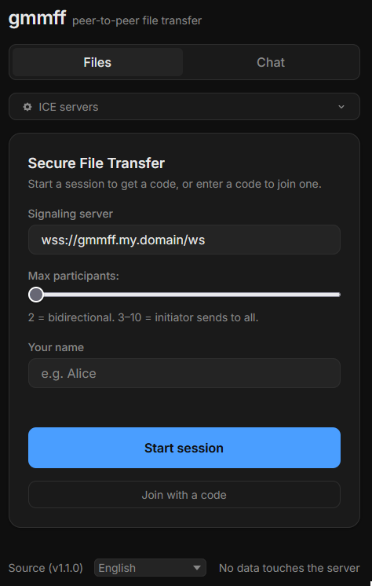

# WASM webclient

WASM is WebAssembly. It let's you run high-preformance code directly in the web browser at near-native speeds. It is included in `gmmff` to enable a simple, yet elegant way to start/join sessions without the need to compile anything (you are welcome non-techys).

## Create wasm file

This file is not in the repo. You will have to generate it manually. There are two methods:

```
make wasm
```
...OR...
```
GOOS=js GOARCH=wasm go build -ldflags="-s -w" -o web/static/gmmff.wasm ./web/cmd/gmmff-wasm
# GO < 1.24
cp "$(go env GOROOT)/misc/wasm/wasm_exec.js" web/static/wasm_exec.js
# GO >= 1.24
cp "$(go env GOROOT)/lib/wasm/wasm_exec.js" web/static/wasm_exec.js
```

## Host static files

Once you have created `gmmff.wasm` and copied `wasm_exec.js` into the `./web/static` directory, you can choose to have these files read by a webserver `sudo cp -r ./web/static/. /var/www/html` or pass in the `--web` argument when you start the signalling server.

## How to use the webclient

### Files tab

Open the **Files** tab, click **Start session** to get a code, or click
**Join with a code** to enter one. Once connected:

- Set your **name** (optional) — shown to other participants as your message label
- Set **Max participants** (2–10) before starting — 2 is bidirectional, 3–10 makes the initiator the broadcaster
- Drag and drop files anywhere on the page, or use **Choose files** / **Choose folder**
- Click **Send** to transfer — the other side auto-downloads once verified
- Type in the message box to send a text message
- **End session** leaves quietly; typing `\q` ends for everyone (initiator) or leaves quietly (responder)

A progress bar appears per transfer. Queued transfers each get their own bar.

### Chat tab

Open the **Chat** tab, click **Start session** to get a code, or click
**Join with a code** to enter one. Type `\q` in the message box to end the
session (initiator) or leave quietly (responder). The **End session** button
always leaves quietly.

## Screenshots

<p align="center">
  
</p>

## Next steps

- Read how to start `gmmff` signalling server at boot using [systemd](SYSTEMD.md)
- Read how to setup a [reverse proxy](NGINX.md) for your signalling server