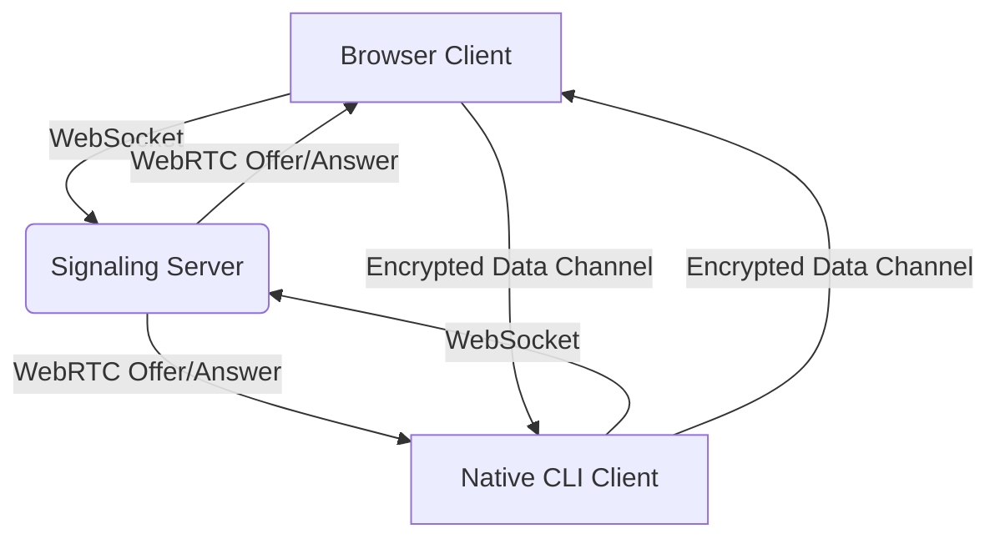

# gmmff Architecture Overview

## Overview

gmmff (pronounced "gimph") is a peer-to-peer file and message transfer system consisting of three main components:

1. **Signaling Server** - A WebSocket broker that brokers initial connections between peers
2. **Native CLI Client** - Handles file/message transfer, chat, and scheduling over encrypted WebRTC data channels (or HTTP for scheduling metadata)
3. **Browser Client** - WebAssembly-based client providing the same functionality as the CLI via a web UI

The signaling server never sees file contents or chat messages—once peers connect, all data flows directly between them over encrypted WebRTC data channels. For scheduling (encrypted dead-drop), the server stores encrypted files temporarily and shares a decryption key via the URL fragment (never transmitted to the server).

## System Components

### Signaling Server (`internal/broker/`, `internal/store/`)

The signaling server is a stateless (from the perspective of peer data), horizontally-scalable WebSocket broker responsible for **rendezvous**: given two peers who share a secret code, link them so they can exchange the messages needed to establish a direct WebRTC connection.

Key components:
- **Hub goroutine**: Central coordinator that owns connection map and slot dispatch, communicates via channels (no shared memory)
- **Connection handlers**: Each WebSocket connection has readPump, writePump goroutines
- **Slot management**: Manages the lifecycle of connection slots (WAITING → READY → CLOSED)
- **Storage layer**: Persists slot state with TTL (10 minutes) using Redis/Valkey for horizontal scaling, with an in-memory fallback for development
- **Protocol forwarding**: Opaquely relays PAKE, SDP, and ICE messages without inspecting payloads

### Clients

#### Native CLI Client (`cmd/gmmff/`)

The CLI client provides commands for:
- `gmmff create` - Initiate a file/message session
- `gmmff join` - Join an existing session using a code
- `gmmff chat` - Pure chat mode
- `gmmff schedule` - Encrypted server-side file transfers (async dead-drop)
- `gmmff serve` - Run the signaling server
- `gmmff local` - Self-contained local-network mode

The client handles:
- **PAKE authentication** (CPace) for mutual authentication without revealing the secret
- **WebRTC connection setup** (SDP offer/answer, ICE candidates)
- **Encrypted data transfer** over WebRTC data channels (DTLS 1.2+) for file transfer and chat
- **File transfer** with progress reporting and integrity checking
- **Messaging** with real-time display
- **File streaming** to avoid temporary disk usage
- **Scheduling**: Encrypts files with AES-256-GCM and uploads to the server via HTTP; downloads decrypt in-browser or CLI

#### Browser Client (`web/cmd/gmmff-wasm/`, `web/static/`)

The browser client is a WebAssembly application that provides a graphical user interface for:
- Creating and joining sessions via codes
- File transfer with drag-and-drop and progress tracking
- Real-time chat messaging
- Scheduling uploads and downloads (client-side decryption)

It shares the same core logic as the CLI for WebRTC connection, PAKE authentication, and data channel communication, compiled to WASM and served as static assets. The browser client connects to the same signaling server and establishes identical peer-to-peer WebRTC connections.

## WebRTC Star Topology

gmmff uses a star-topology WebRTC architecture where the signaling server acts as the central rendezvous point, but **not** as a media relay:



1. Both clients establish WebSocket connections to the signaling server
2. The server matches clients sharing a secret code and facilitates WebRTC signaling
3. Once ICE connectivity is established, clients communicate directly over encrypted WebRTC data channels
4. The server's role ends after the data channel is open; it does not relay application data

## Chat Feature

Chat messages are transmitted over the same WebRTC data channel used for file transfer:
- Text messages are serialized as protocol envelopes and sent via the data channel
- The channel is already encrypted with DTLS 1.2+, providing confidentiality and integrity
- No additional encryption or server involvement is needed
- Messages appear in real-time in both CLI and browser UIs
- The signaling server only sees the opaque envelope forwards during connection setup; once the data channel is open, it does not observe chat traffic

## Scheduling Feature

The scheduling feature (`gmmff schedule`) provides asynchronous, server-side encrypted file transfers:

1. **Upload** (`gmmff schedule upload`):
   - Client encrypts file(s) with AES-256-GCM using a random key
   - Encrypted blob is uploaded to the signaling server via HTTP POST
   - Server stores the encrypted blob locally (filesystem) with metadata (TTL, max downloads)
   - Server returns a share URL containing an encrypted blob ID
   - Decryption key is kept client-only (shown in output, placed in URL fragment for web)

2. **Download** (`gmmff schedule download` or browser):
   - Client fetches encrypted blob from server via HTTP GET
   - Decrypts locally using the key from URL fragment (never sent to server)
   - Browser client performs decryption in WebAssembly; CLI uses native crypto

**Integration with broker**:
- The scheduling HTTP endpoints are served by the same `gmmff serve` process that runs the WebSocket broker
- However, scheduling **does not use** the WebSocket broker or slot storage for file data
- The broker is only used for real-time features (live file transfer and chat)
- Scheduling uses the server's local disk storage for encrypted blobs (configurable path)
- Server never sees plaintext; decryption key resides only in URL fragment (client-side)

## Storage Options

### Slot State (Broker)
- **Primary**: Redis/Valkey (horizontal scaling, automatic TTL expiration)
  - Key: `slot:<UUID>` (hash, slot metadata)
  - Key: `code:<3-word>` (string, maps to slot ID)
  - TTL: 10 minutes (configurable)
- **Fallback**: In-memory map (single-node, development only)
  - No TTL enforcement, not suitable for production
  - Selected via `--memory` flag or when Redis is unreachable

### Scheduling Storage
- Encrypted file blobs stored on server's local filesystem
- Configurable via `--schedule-storage-path` flag (defaults to `./schedule_data`)
- Metadata stored alongside blobs (expiry, download count)
- No use of Redis/Valkey for scheduling blobs

### Web UI Assets
- Static files (HTML, CSS, JS, WASM) served from `web/static/`
- In production, served by reverse proxy (nginx, Caddy) or CDN
- Development server (`go run ./web`) provides hot reload

## Data Flow (Live Transfer)

1. **Peer A** runs `gmmff create` → generates UUID + 3-word code, stores slot in Redis with TTL
2. **Peer A** shares code out-of-band with **Peer B**
3. **Peer B** runs `gmmff join <code>` → resolves code → slot UUID
4. **CPace PAKE** authenticates both peers → shared secret established
5. **SDP exchange** (offer/answer) → HMAC-signed with PAKE secret
6. **ICE candidate exchange** → establishes direct connection
7. **WebRTC data channel opens** → signaling server's job is done
8. **Peers enter session REPL** → exchange files/messages directly over encrypted channel

## Slot Lifecycle

```text
slot.create
    │
    ▼
┌─────────┐      slot.join        ┌───────┐     bye / expire
│ WAITING │ ──────────────────► │ READY │ ──────────────────► CLOSED
└─────────┘                     └───────┘
    │
    │ TTL expires (no join)
    ▼
 CLOSED (auto-reaped by Redis TTL)
```

State transitions are validated in `internal/slot/slot.go` before any store write, ensuring the broker never persists invalid state.

## Deployment Options

1. **Docker Compose** - See `docker-compose.yml`
2. **Local Go + Redis/Valkey** - Requires Go 1.23+ and Redis/Valkey 7+
   - Development: `go run ./cmd/gmmff serve --memory`
   - Production: `go run ./cmd/gmmff serve` (with `GMMFF_REDIS_URL` set)
3. **Systemd** - See `docs/SYSTEMD.md`
4. **NGINX reverse proxy** - See `docs/NGINX.md`
5. **Browser Client** - Build WASM with `go run ./web/cmd/gmmff-wasm`; serve static files via any web server

## Key Source Files

- Signaling server: `/internal/broker/`
- Slot management: `/internal/slot/`
- Storage layer: `/internal/store/`
- CLI commands: `/cmd/gmmff/` (create, join, chat, schedule, serve, local)
- Browser client: `/web/cmd/gmmff-wasm/` and `/web/static/`
- WebRTC/P2P logic: `/internal/peer/` and `/internal/transfer/`
- Cryptography: `/internal/pake/` and `/internal/crypto/`
- Scheduling HTTP handlers: `/cmd/gmmff/schedule.go`
