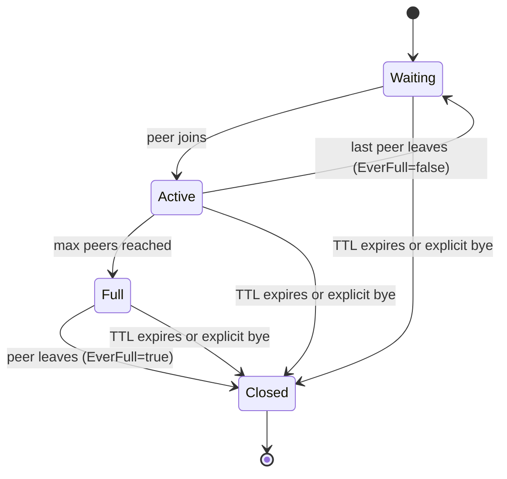

# gmmff Architecture Overview

## Overview

gmmff (pronounced "gimph") is a peer-to-peer file and message transfer system consisting of three main components:

1. **Signaling Server** - A WebSocket broker that brokers initial connections between peers
2. **CLI Client** - Handles actual file/message transfer over encrypted WebRTC data channels (commands: `create`, `join`, `chat`, `local`)
3. **Persistence Store** - Redis-backed (or in-memory) storage for slot state with TTL

The signaling server never sees file contents—once peers connect, all data flows directly between them over encrypted WebRTC data channels.

## System Components

### Signaling Server (`internal/broker/`)

The signaling server is a stateless (from the perspective of peer data), horizontally-scalable WebSocket broker responsible for **rendezvous**: given two peers who share a secret code, link them so they can exchange the messages needed to establish a direct WebRTC connection.

Key components:
- **Hub goroutine**: Central coordinator that owns connection map and slot dispatch, communicates via channels (no shared memory)
- **Connection handlers**: Each WebSocket connection has readPump, writePump goroutines
- **Slot management**: Manages the lifecycle of connection slots (WAITING → READY → CLOSED)
- **Redis/Valkey storage**: Persists slot state with TTL (10 minutes) for horizontal scaling
- **Memory store fallback**: In-memory map for development (no TTL, single-node only)

### CLI Client (`cmd/gmmff/`)

The CLI client provides commands for:
- `gmmff create` - Initiate a file/message session
- `gmmff join` - Join an existing session using a code
- `gmmff chat` - Pure chat mode
- `gmmff serve` - Run the signaling server
- `gmmff local` - Self-contained local-network mode

The client handles:
- **PAKE authentication** (CPace) for mutual authentication without revealing the secret
- **WebRTC connection setup** (SDP offer/answer, ICE candidates)
- **Encrypted data transfer** over WebRTC data channels (DTLS 1.2+)
- **File transfer** with progress reporting and integrity checking
- **Messaging** with real-time display
- **File streaming** to avoid temporary disk usage

### Persistence Store (`internal/store/`)

The store implements a Redis-backed persistence layer for gmmff slots with the following layout:
- `slot:<slot_id>` - Hash containing slot JSON with TTL
- `code:<code>` - String mapping code to slot_id with same TTL

Both keys share the same TTL so expiry is atomic from the user's perspective. The store never writes connection IDs or any data that could identify a user.

An in-memory fallback store exists for development/testing.

### Slot Model (`internal/slot/`)

The slot domain model defines the lifecycle of a rendezvous session:
- **Waiting**: initiator connected, code issued, accepting joins
- **Active**: at least one peer joined, still accepting if not full
- **Full**: max peers reached, no longer accepting joins
- **Closed**: bye received, initiator left, or TTL expired

State transitions are validated before any store write, ensuring the broker never persists invalid state. The slot supports multi-peer sessions up to a configurable maximum (default 2, hard limit 10).

## Data Flow

```mermaid
sequenceDiagram
    participant A as Peer A (gmmff create)
    participant B as Peer B (gmmff join)
    participant S as Signaling Server
    
    A->>S: WebSocket connect + SlotCreate
    S->>A: SlotCreated (slotID, 3-word code)
    A->>B: Share code out-of-band
    B->>S: WebSocket connect + SlotJoin (code)
    S->>B: SlotJoined (slotID)
    S->>A: PeerJoined (B's connection ID)
    S->>B: PeerJoined (A's connection ID)
    
    loop PAKE/SDP/ICE Signaling
        A<->>S: Opaque relay (PAKE, SDP, ICE)
        S<->>B: Opaque relay (PAKE, SDP, ICE)
    end
    
    A->>B: WebRTC Data Channel (DTLS encrypted)
    B->>A: WebRTC Data Channel (DTLS encrypted)
    
    A->>B: File/message data
    B->>A: File/message data
```

**Step-by-step flow:**

1. **Peer A** runs `gmmff create` → generates UUID + 3-word code, stores slot in Redis with 10-min TTL
2. **Peer A** shares code out-of-band with **Peer B**
3. **Peer B** runs `gmmff join <code>` → resolves code → slot UUID
4. **CPace PAKE** authenticates both peers → shared secret established (messages relayed opaquely via signaling server)
5. **SDP exchange** (offer/answer) → HMAC-signed with PAKE secret to prevent MITM
6. **ICE candidate exchange** → establishes direct connection
7. **WebRTC data channel opens** → signaling server's job is done
8. **Peers enter session REPL** → exchange files/messages directly over encrypted channel

## Slot Lifecycle



State transitions are validated in `internal/slot/slot.go` before any store write, ensuring the broker never persists invalid state.

## Security Model

1. **Password Authenticated Key Exchange (PAKE)** - CPace protocol establishes a shared secret between peers without revealing the password to the server
2. **SDP HMAC signing** - Session Description Protocol messages are HMAC-signed with the PAKE secret to prevent man-in-the-middle attacks
3. **WebRTC/DTLS encryption** - All media and data channels are encrypted with DTLS 1.2+
4. **Privacy-preserving logging** - Logs contain no IPs, user agents, file names, or transfer contents
5. **Message size limits** - 64 KiB max WebSocket frame size, 16-frame send buffer per connection
6. **Connection timeouts** - 10s write timeout, 60s pong timeout per WebSocket connection
7. **Memory exhaustion protection** - Bounded buffers and timeouts prevent resource exhaustion
8. **Opaque relay** - Signaling server never decodes PAKE/SDP/ICE payloads, forwarding them as raw bytes

## Deployment Options

1. **Docker Compose** - See `docker-compose.yml`
2. **Local Go + Redis/Valkey** - Requires Go 1.23+ and Redis/Valkey 7+
   - Development: `go run ./cmd/gmmff serve --memory`
   - Production: `go run ./cmd/gmmff serve` (with `GMMFF_REDIS_URL` set)
3. **Systemd** - See `docs/SYSTEMD.md`
4. **NGINX reverse proxy** - See `docs/NGINX.md`

## Key Source Files

- Signaling server: `/internal/broker/broker.go`
- Slot management: `/internal/slot/slot.go`
- Storage layer: `/internal/store/store.go`
- CLI commands: `/cmd/gmmff/` (create.go, join.go, chat.go, local.go, serve.go)
- WebRTC/P2P logic: `/internal/peer/` and `/internal/transfer/`
- Cryptography: `/internal/pake/` and `/internal/crypto/`
