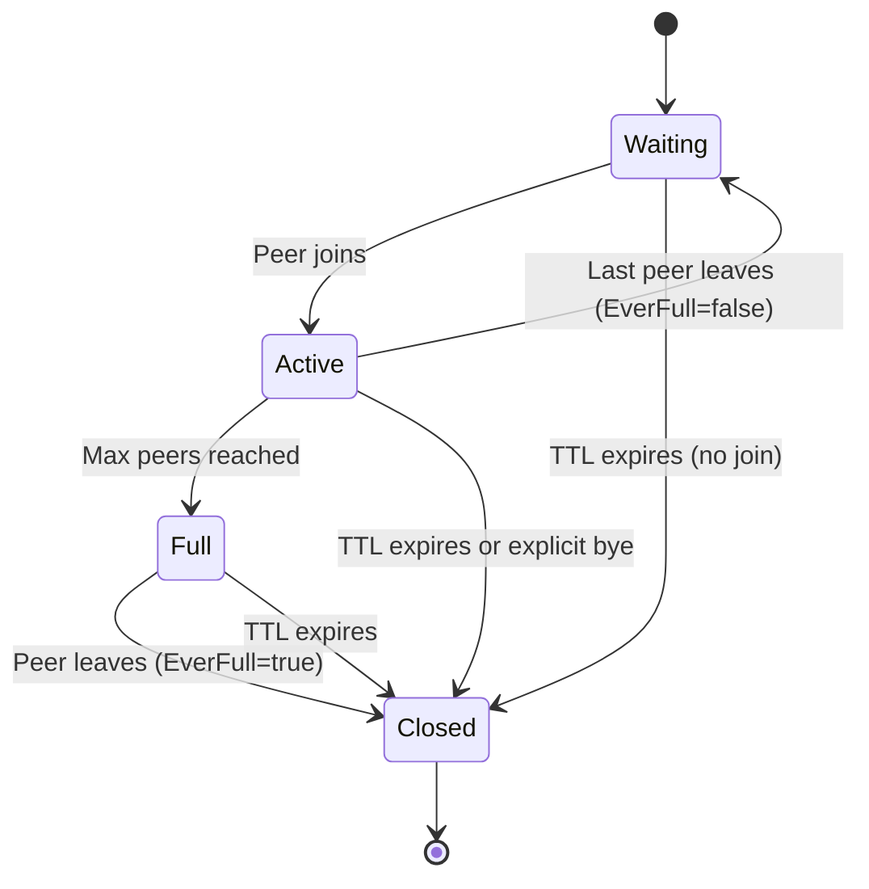

# gmmff Architecture Overview

gmmff (pronounced "gimph") is a peer-to-peer file and message transfer system consisting of two main components:

1. **Signaling Broker** - A WebSocket broker that brokers initial connections between peers
2. **CLI Client** - Handles actual file/message transfer over encrypted WebRTC data channels

The signaling broker never sees file contents—once peers connect, all data flows directly between them over encrypted WebRTC data channels.

## System Components

### Signaling Broker (`internal/broker/`)

The signaling broker is a stateless (from the perspective of peer data), horizontally-scalable WebSocket broker responsible for **rendezvous**: given two peers who share a secret code, link them so they can exchange the messages needed to establish a direct WebRTC connection.

Key components:
- **Hub goroutine**: Central coordinator that owns connection map and slot dispatch, communicates via channels (no shared memory)
- **Connection handlers**: Each WebSocket connection has readPump, writePump goroutines
- **Slot management**: Manages the lifecycle of connection slots (WAITING → ACTIVE → FULL → CLOSED)
- **Redis/Valkey storage**: Persists slot state with TTL (10 minutes) for horizontal scaling
- **Memory store fallback**: In-memory map for development (no TTL, single-node only)

Responsibilities:
1. Accept WebSocket connections and register them as named connections
2. Route protocol messages between the two peers sharing a slot
3. Enforce the slot lifecycle (create → waiting → ready → closed)
4. Gate-keep relay: the broker NEVER decodes PAKE/SDP/ICE payloads — it forwards them opaquely so the server cannot intercept the session

Concurrency model:
- One goroutine per connection (readPump) reads inbound messages
- One goroutine per connection (writePump) serialises outbound writes
- The hub goroutine owns all slot/connection maps — no mutexes needed
- All cross-goroutine communication uses channels

### Signaling Client Implementations (`internal/signaling/`)

The `internal/signaling/` package provides WebSocket client implementations for different platforms:
- **Native Go client** (`client_native.go`) - Used in the CLI client
- **WebAssembly/JavaScript client** (`client_js.go`) - For potential browser-based clients
- **Base64 utilities** (`b64.go`) - Encoding/decoding helpers

These clients implement a consistent API (Connect, Client, Message, WaitFor, etc.) so that peer-to-peer logic in `internal/peer/` remains platform-agnostic.

### CLI Client (`cmd/gmmff/`)

The CLI client provides commands for:
- `gmmff create` - Initiate a file/message session
- `gmmff join` - Join an existing session using a code
- `gmmff chat` - Pure chat mode
- `gmmff serve` - Run the signaling broker
- `gmmff local` - Self-contained local-network mode

The client handles:
- **PAKE authentication** (CPace) for mutual authentication without revealing the secret
- **WebRTC connection setup** (SDP offer/answer, ICE candidates)
- **Encrypted data transfer** over WebRTC data channels (DTLS 1.2+)
- **File transfer** with progress reporting and integrity checking
- **Messaging** with real-time display
- **File streaming** to avoid temporary disk usage

### Slot Management (`internal/slot/`)

Defines the domain model for a gmmff rendezvous slot with lifecycle:
- **Waiting**: Initiator connected, code issued, accepting joins
- **Active**: At least one peer joined, still accepting if not full
- **Full**: Max peers reached, no longer accepting joins
- **Closed**: Bye received, initiator left, or TTL expired

Key constants:
- Default TTL: 10 minutes
- Max allowed peers per session: 10 (initiator + up to 9 responders)
- Default max peers: 2
- Max WebSocket frame size: 64 KiB

State transitions are validated before any store write, ensuring the broker never persists invalid state.

### Cryptography & Security (`internal/pake/` and `/internal/crypto/`)

1. **Password Authenticated Key Exchange (PAKE)** - CPace protocol establishes a shared secret between peers without revealing the password to the server
2. **SDP HMAC signing** - Session Description Protocol messages are HMAC-signed with the PAKE secret to prevent man-in-the-middle attacks
3. **WebRTC/DTLS encryption** - All media and data channels are encrypted with DTLS 1.2+
4. **Privacy-preserving logging** - Logs contain no IPs, user agents, file names, or transfer contents
5. **Memory exhaustion protection** - 64 KiB max message size, 16-frame send buffer per connection
6. **Slow-read protection** - 10s write timeout, 60s pong timeout per WebSocket connection

### Storage Layer (`internal/store/`)

Abstracts slot persistence with two implementations:
- **Redis/Valkey store**: Primary production implementation with TTL-based expiration
- **Memory store**: Development-only fallback (no persistence, single-node)

The store interface defines operations for slot creation, retrieval, updating, and deletion.

### WebRTC/P2P Logic (`internal/peer/` and `/internal/transfer/`)

Handles the direct peer-to-peer connection after signaling:
- WebRTC peer connection management (offer/answer exchange)
- ICE candidate gathering and connectivity checks
- Data channel creation and configuration
- File transfer mechanics (chunking, integrity checking, progress reporting)
- Message exchange over data channels

## Data Flow

1. **Peer A** runs `gmmff create` → generates UUID + 3-word code, stores in Redis with 10-min TTL
2. **Peer A** shares code out-of-band with **Peer B**
3. **Peer B** runs `gmmff join <code>` → resolves code → slot UUID
4. **CPace PAKE** authenticates both peers → shared secret established
5. **SDP exchange** (offer/answer) → HMAC-signed with PAKE secret
6. **ICE candidate exchange** → establishes direct connection
7. **WebRTC data channel opens** → signaling broker's job is done
8. **Peers enter session REPL** → exchange files/messages directly over encrypted channel

## Slot Lifecycle

```mermaid
stateDiagram-v2
    [*] --> Waiting
    Waiting --> Active: Peer joins
    Active --> Full: Max peers reached
    Full --> Closed: Peer leaves (EverFull=true)
    Active --> Waiting: Last peer leaves (EverFull=false)
    Waiting --> Closed: TTL expires (no join)
    Active --> Closed: TTL expires or explicit bye
    Full --> Closed: TTL expires
    Closed --> [*]
```

State transitions are validated in `internal/slot/slot.go` before any store write, ensuring the broker never persists invalid state.

## Deployment Options

1. **Docker Compose** - See `docker-compose.yml`
2. **Local Go + Redis/Valkey** - Requires Go 1.23+ and Redis/Valkey 7+
   - Development: `go run ./cmd/gmmff serve --memory`
   - Production: `go run ./cmd/gmmff serve` (with `GMMFF_REDIS_URL` set)
3. **Systemd** - See `docs/SYSTEMD.md`
4. **NGINX reverse proxy** - See `docs/NGINX.md`

## Key Source Files

- Signaling broker: `/internal/broker/`
- Slot management: `/internal/slot/`
- Storage layer: `/internal/store/`
- CLI commands: `/cmd/gmmff/`
- WebRTC/P2P logic: `/internal/peer/` and `/internal/transfer/`
- Cryptography: `/internal/pake/` and `/internal/crypto/`
- Signaling clients: `/internal/signaling/`
- Configuration: `/cmd/gmmff/main.go` (flag parsing) and `docs/ENV.md`

## Related Documentation

<!-- openwiki: broken internal link [/docs/ARCHITECTURE.md] link "/docs/ARCHITECTURE.md" is root-absolute, which no real consumer resolves against the repository root (not a coding agent reading the page, not GitHub's Markdown renderer, not a local viewer); use a path relative to this file instead. Fix the href or restore the target, then delete this comment. -->
- [Architecture Document](/docs/ARCHITECTURE.md) - Detailed architecture deep dive
<!-- openwiki: broken internal link [/docs/SECURITY.md] link "/docs/SECURITY.md" is root-absolute, which no real consumer resolves against the repository root (not a coding agent reading the page, not GitHub's Markdown renderer, not a local viewer); use a path relative to this file instead. Fix the href or restore the target, then delete this comment. -->
- [Security Document](/docs/SECURITY.md) - Security model and threat model
<!-- openwiki: broken internal link [/docs/PROTOCOL.md] link "/docs/PROTOCOL.md" is root-absolute, which no real consumer resolves against the repository root (not a coding agent reading the page, not GitHub's Markdown renderer, not a local viewer); use a path relative to this file instead. Fix the href or restore the target, then delete this comment. -->
- [Protocol Document](/docs/PROTOCOL.md) - Wire protocol specification
<!-- openwiki: broken internal link [/docs/CMDS.md] link "/docs/CMDS.md" is root-absolute, which no real consumer resolves against the repository root (not a coding agent reading the page, not GitHub's Markdown renderer, not a local viewer); use a path relative to this file instead. Fix the href or restore the target, then delete this comment. -->
- [Commands Document](/docs/CMDS.md) - CLI command reference
<!-- openwiki: broken internal link [/docs/ENV.md] link "/docs/ENV.md" is root-absolute, which no real consumer resolves against the repository root (not a coding agent reading the page, not GitHub's Markdown renderer, not a local viewer); use a path relative to this file instead. Fix the href or restore the target, then delete this comment. -->
- [Environment Variables](/docs/ENV.md) - Configuration reference
