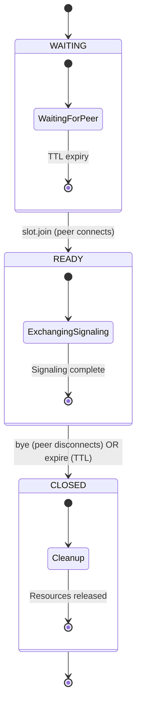

# Domain Concepts Overview

## Core Concepts

gmmff revolves around several core domain concepts that enable secure peer-to-peer communication:

### Session

A **session** represents a peer-to-peer file and message transfer session between two or more peers. A session is established when peers share a secret code and successfully complete the PAKE authentication and WebRTC handshake.

Key characteristics:
- Ephemeral: exists only for the duration of the peer connection
- Secure: all data transferred is encrypted end-to-end
- Multi-peer: supports 2-10 peers in a single session
- Interactive: provides a REPL for sending files and messages

### Slot

A **slot** is the server-side representation of a session waiting for peers to join. It lives in the signaling server's storage (Redis/Valkey or in-memory map) and tracks the state of peers attempting to establish a session.

Slot lifecycle:
1. **WAITING**: Created by first peer (`gmmff create`), waiting for peers`), waiting for additional peers
2. **READY**: All expected peers have connected, ready to exchange signaling
3. **CLOSED**: Session ended (peer disconnected or TTL expired)

Slot structure:
- UUID: Unique identifier for the slot
- State: Current state (WAITING, READY, CLOSED)
- CreatedAt: Timestamp when slot was created
- ExpiresAt: Timestamp when slot expires (10 minutes after creation)
- PeerA/PeerB: WebSocket connection IDs of connected peers (optional)

### PAKE (Password Authenticated Key Exchange)

**PAKE** is the cryptographic protocol that allows two peers to establish a shared secret over an insecure channel (the signaling server) without revealing the secret to the server.

gmmff uses the **CPace** protocol:
- Input: low-entropy secret (the 3-word code)
- Output: strong shared secret key
- Properties:
  - Mutual authentication: both peers verify they know the same secret
  - Key derivation: generates cryptographic keys for subsequent encryption
  - Server oblivious: server sees only protocol messages, cannot derive secret
  - Resistant to offline dictionary attacks

The PAKE secret is used to:
1. Derive keys for HMAC-signing SDP messages (prevents MITM)
2. Seed the key derivation for WebRTC/DTLS encryption

### WebRTC Data Channel

Once peers have established a shared secret via PAKE, they establish a direct **WebRTC data channel** for transferring files and messages.

Key properties:
- **Peer-to-peer**: data flows directly between peers after initial signaling
- **Encrypted**: DTLS 1.2+ provides encryption and authentication
- **Ordered/Unordered**: can configure reliability per channel
- **Congestion controlled**: uses UDP-based congestion control (similar to TCP)
- **Message-oriented**: preserves message boundaries (unlike byte streams)

gmmff uses:
- **DTLS-SRTP** for encryption (standard WebRTC security)
- **SCTP over DTLS** for data transport
- **Partial reliability** for file transfers (retransmits lost packets)
- **Unreliable** for chat messages (low latency, occasional loss acceptable)

### Slot State Machine

The slot lifecycle is managed by a strict state machine to prevent invalid states:

State transitions are validated in `internal/slot/slot.go` before any storage write, ensuring the signaling server never persists invalid state.

### Cryptographic Flow

1. **PAKE Exchange** (via signaling server)
   - Peer A: `pake1` → Server → Peer B
   - Peer B: `pake2` → Server → Peer A
   - Result: Both derive shared secret `S`

2. **SDP Exchange** (HMAC-signed with `S`)
   - Peer A: `sdp1 = offer || HMAC_S(offer)` → Server → Peer B
   - Peer B: `sdp2 = answer || HMAC_S(answer)` → Server → Peer A
   - Verification: Each peer verifies HMAC using `S`

3. **ICE Exchange** (not HMAC-signed, but integrity protected by DTLS)
   - Peer A: `ice1` → Server → Peer B
   - Peer B: `ice2` → Server → Peer A

4. **DTLS Handshake** (uses keys derived from `S`)
   - Establishes encrypted SRTP/SCTP associations

5. **SCTP Data Channel** (application data)
   - File transfer and messaging over encrypted channel

## Key Source Files by Concept

### Session Management
- `cmd/gmmff/create.go` - `gmmff create` command
- `cmd/gmmff/join.go` - `gmmff join` command
- `cmd/gmmff/chat.go` - `gmmff chat` command
- `internal/session/session.go` - Core session logic
- `internal/session/session_test.go` - Session tests

### Slot Management
- `internal/slot/slot.go` - Slot struct and state transitions
- `internal/slot/slot_test.go` - Slot tests
- `internal/store/` - Storage abstractions (Redis, memory)

### PAKE/Cryptography
- `internal/pake/` - CPace implementation
- `internal/crypto/` - HKDF, HMAC, and key derivation
- `internal/protocol/` - Protocol message definitions and HMAC signing

### WebRTC/P2P
- `internal/peer/` - Peer connection management
- `internal/transfer/` - File transfer over data channels
- `internal/chat/` - Chat messaging over data channels

### Storage
- `internal/store/memory.go` - In-memory store (dev)
- `internal/store/redis.go` - Redis/Valkey store
- `internal/store/store.go` - Storage interface

## Related Concepts

### Configuration
- Environment variables (see `docs/ENV.md`)
- Command-line flags (see `docs/CMDS.md`)
- Configuration validation (`internal/conf/`)

### Error Handling
- Error types (`internal/err/` context wrapping)
- Context-aware logging (`internal/log/`)

### Metrics
- Prometheus metrics (`internal/metrics/`)
- Health checks (`/healthz`, `/readyz` endpoints)

## Domain Boundaries

### Bounded Contexts

1. **Signaling Context** (`internal/broker/`, `internal/signaling/`, `internal/slot/`, `internal/store/`)
   - Responsible for brokering initial peer connections
   - Manages slot lifecycle and state
   - Never sees file contents or decryption keys

2. **Peer Connection Context** (`internal/peer/`, `internal/transfer/`, `internal/chat/`)
   - Handles WebRTC connection establishment
   - Manages data channels for file/messages transfer
   - Handles encryption via keys derived from PAKE

3. **Cryptographic Context** (`internal/pake/`, `internal/crypto/`)
   - Implements PAKE (CPace) for key establishment
   - Provides cryptographic primitives (HKDF, HMAC)
   - Handles SDP message signing

4. **Application Context** (`cmd/gmmff/`, `internal/session/`)
   - CLI command implementations
   - Session REPL and user interaction
   - File system interaction (reading/writing files)

## Data Flow Summary

1. **Session Initiation**
   - User runs `gmmff create` → creates slot in storage → gets 3-word code
   - User shares code out-of-band

2. **Peer Joining**
   - Peer runs `gmmff join <code>` → resolves code to slot UUID
   - Both peers now connected to signaling server

3. **Key Establishment**
   - PAKE exchange via signaling server → shared secret established
   - SDP exchange (HMAC-signed with secret) → WebRTC parameters agreed
   - ICE exchange → network path established

4. **Direct Connection**
   - Signaling server's job is complete
   - Peers establish encrypted WebRTC data channel directly
   - All subsequent file/message transfer is peer-to-peer

5. **Session Interaction**
   - Users send files/messages via session REPL
   - Data transferred directly over encrypted channel
   - Session ends when peers disconnect or TTL expires

## See Also

- [Architecture Overview](/openwiki/architecture/overview.md) - System components and deployment
- [Key Workflows](/openwiki/workflows/key-workflows.md) - Step-by-step walkthroughs of common operations
- [Source Map](/openwiki/source-map.md) - Direct mapping of concepts to source files
- [Operations & Runbook](/openwiki/operations/runbook.md) - Deployment, configuration, and maintenance