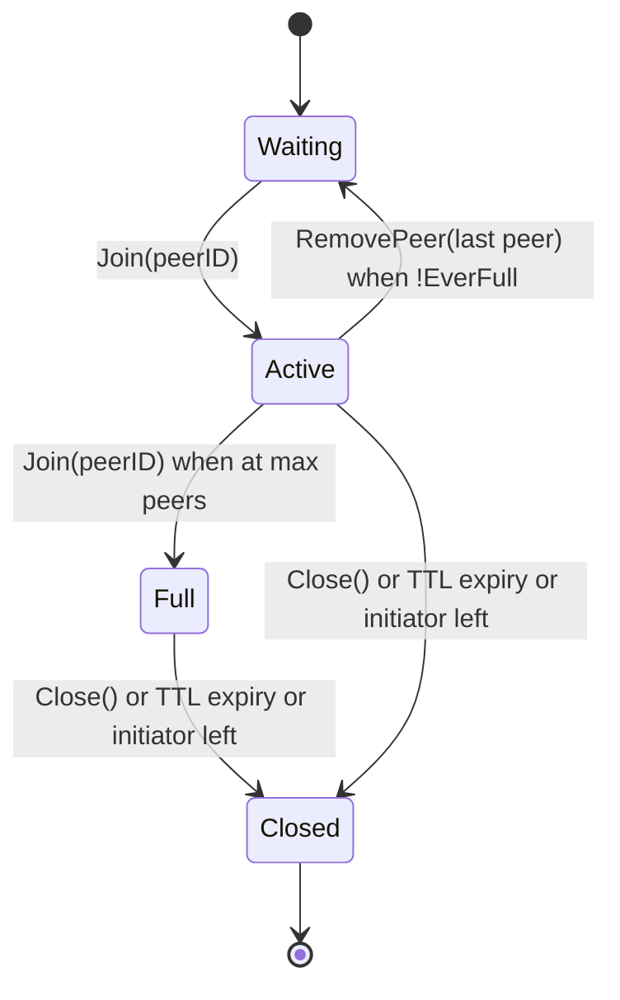
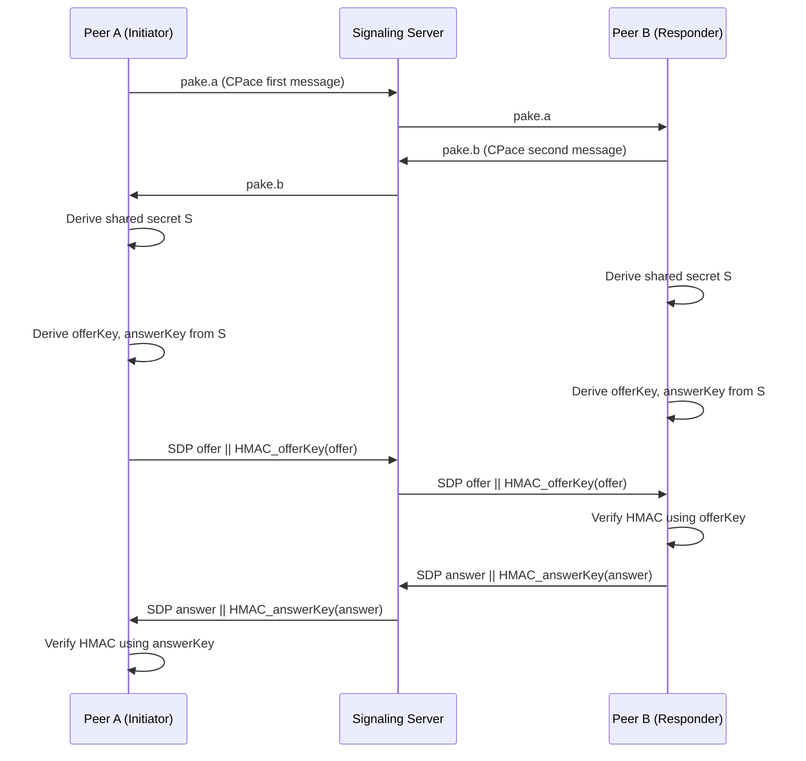

# Domain Concepts

gmmff revolves around several core domain concepts that enable secure peer-to-peer communication.

## Session

A **session** represents a peer-to-peer file and message transfer session between two or more peers. A session is established when peers share a secret code and successfully complete the PAKE authentication and WebRTC handshake.

Key characteristics:
- Ephemeral: exists only for the duration of the peer connection
- Secure: all data transferred is encrypted end-to-end
- Multi-peer: supports 2-10 peers in a single session
- Interactive: provides a REPL for sending files and messages

## Slot

A **slot** is the server-side representation of a session waiting for peers to join. It lives in the signaling server's storage (Redis/Valkey or in-memory map) and tracks the state of peers attempting to establish a session.

Slot lifecycle:
1. **Waiting**: Created by first peer (`gmmff create`), waiting for peers to join
2. **Active**: At least one peer has joined, slot still accepting new peers (if not full)
3. **Full**: Maximum peers reached, no longer accepting new joins
4. **Closed**: Session ended (peer disconnected, initiator left, or TTL expired)

Slot structure:
- ID: Unique identifier for the slot
- Code: Short human-readable code used for joining
- State: Current state (Waiting, Active, Full, Closed)
- InitiatorID: WebSocket connection ID of the peer that created the slot
- PeerIDs: Slice of WebSocket connection IDs of joined peers (excluding initiator)
- CreatedAt: Timestamp when slot was created
- ExpiresAt: Timestamp when slot expires (10 minutes after creation)
- MaxPeers: Total number of participants allowed (initiator counts as 1)
- EverFull: Boolean flag set true once slot reaches MaxPeers; prevents reopening after peers leave

The slot state machine enforces valid transitions:
- Waiting → Active: when a peer joins via `Join`
- Active → Full: when `ConnectedCount()` reaches `MaxPeers` (sets `EverFull = true`)
- Active/Full → Closed: on explicit close, initiator departure, or TTL expiry
- Active → Waiting: if `EverFull` is false and the last non-initiator peer leaves

```mermaid
stateDiagram-v2
    [*] --> Waiting
    Waiting --> Active: Join(peerID)
    Active --> Full: Join(peerID) when at max peers
    Full --> Closed: Close() or TTL expiry or initiator left
    Active --> Closed: Close() or TTL expiry or initiator left
    Active --> Waiting: RemovePeer(last peer) when !EverFull
    Closed --> [*]
```

State transitions are validated in `internal/slot/slot.go` before any storage write, ensuring the signaling server never persists invalid state.

## PAKE (Password Authenticated Key Exchange)

**PAKE** is the cryptographic protocol that allows two peers to establish a shared secret over an insecure channel (the signaling server) without revealing the secret to the server.

gmmff uses the **CPace** protocol:
- Input: low-entropy secret (the 3-word code)
- Output: strong shared secret key
- Properties:
  - Mutual authentication: both peers verify they know the same secret
  - Key derivation: generates cryptographic keys for subsequent encryption
  - Server oblivious: server sees only protocol messages, cannot derive secret
  - Resistant to offline dictionary attacks

The PAKE secret is used to:
1. Derive subkeys for HMAC-signing SDP messages (prevents MITM)
2. Seed the key derivation for WebRTC/DTLS encryption

After the CPace exchange, two subkeys are derived via HKDF:
- `offerKey`: signs/verifies the SDP offer
- `answerKey`: signs/verifies the SDP answer

The initiator signs the offer with `offerKey` and verifies the answer with `answerKey`. The responder does the reverse.

```mermaid
sequenceDiagram
    participant A as Peer A (Initiator)
    participant S as Signaling Server
    participant B as Peer B (Responder)
    
    A->>S: pake.a (CPace first message)
    S->>B: pake.a
    B->>S: pake.b (CPace second message)
    S->>A: pake.b
    A->>A: Derive shared secret S
    B->>B: Derive shared secret S
    A->>A: Derive offerKey, answerKey from S
    B->>B: Derive offerKey, answerKey from S
    A->>S: SDP offer || HMAC_offerKey(offer)
    S->>B: SDP offer || HMAC_offerKey(offer)
    B->>B: Verify HMAC using offerKey
    B->>S: SDP answer || HMAC_answerKey(answer)
    S->>A: SDP answer || HMAC_answerKey(answer)
    A->>A: Verify HMAC using answerKey
```

## WebRTC Data Channel

Once peers have established a shared secret via PAKE, they establish a direct **WebRTC data channel** for transferring files and messages.

Key properties:
- **Peer-to-peer**: data flows directly between peers after initial signaling
- **Encrypted**: DTLS 1.2+ provides encryption and authentication
- **Ordered/Unordered**: can configure reliability per channel
- **Congestion controlled**: uses UDP-based congestion control (similar to TCP)
- **Message-oriented**: preserves message boundaries (unlike byte streams)

gmmff uses:
- **DTLS-SRTP** for encryption (standard WebRTC security)
- **SCTP over DTLS** for data transport
- **Partial reliability** for file transfers (retransmits lost packets)
- **Unreliable** for chat messages (low latency, occasional loss acceptable)

The WebRTC connection setup follows the standard offer/answer exchange with ICE trickling, authenticated via PAKE-derived HMACs on SDP messages.

```mermaid
sequenceDiagram
    participant A as Peer A
    participant B as Peer B
    
    A->>A: Create RTCPeerConnection
    A->>A: Create DataChannel (ordered for files, unordered for chat)
    A->>A: SetLocalDescription (offer)
    A->>B: Offer (via signaling, HMAC signed)
    B->>B: SetRemoteDescription (offer)
    B->>B: Create answer
    B->>B: SetLocalDescription (answer)
    B->>A: Answer (via signaling, HMAC signed)
    A->>A: SetRemoteDescription (answer)
    A<->B: ICE candidate exchange (via signaling)
    A->>B: DTLS handshake (uses keys from PAKE secret)
    A<->B: SRTP/SCTP associations established
    A<->B: DataChannel open -> application data transfer
```

## Local Mode

When `LocalMode` is enabled, gmmff operates without requiring internet connectivity:
- ICE server list is empty (only host candidates are gathered)
- No STUN/TURN server contact
- Peers connect directly via local network (e.g., same Wi-Fi)
- Useful for air-gapped environments or development

Local mode is configured via the `-local` flag or `GMMFF_LOCAL_MODE=true` environment variable.

## TURN (Traversal Using Relays around NAT)

When direct peer-to-peer connection fails (due to symmetric NAT or restrictive firewalls), gmmff can use TURN servers to relay traffic.

TURN configuration:
- Specified via `-turn` flag or `GMMFF_TURN_SERVERS` environment variable
- Supports both long-term credentials (`user`/`pass`) and ephemeral credentials (via `secret`)
- Multiple TURN servers can be provided (up to 3)
- TURN URLs follow the format: `turn:host:port[?transport=udp&user=foo&pass=bar]` or `turns:host:port?secret=abc`

The TURN integration is handled in `internal/turn/` and used by the WebRTC ICE agent to obtain relay candidates when needed.

## Storage

Slots are persisted in a signaling server storage backend:
- **Redis/Valkey**: Production storage with automatic TTL-based expiry
- **In-memory map**: Development storage (no persistence across restarts)

Both implementations share the same interface (`internal/store/store.go`). Storage keys:
- `slot:<slot_id>`: Hash containing slot JSON fields
- `code:<code>`: String mapping slot code to slot_id
Both keys share the same TTL (10 minutes) so expiry is atomic.

## Scheduling and Cleanup

Expired slots are cleaned up by a background scheduler:
- The scheduler runs periodically (default interval 1 minute)
- Scans all slots and removes those where `IsExpired()` returns true
- Also removes slots in `Closed` state that have been inactive for a grace period
- Implemented in `internal/schedule/` (cleanup.go, handler.go, store.go)

This ensures storage does not accumulate stale slots over time.

## Domain Boundaries

### Bounded Contexts

1. **Signaling Context** (`internal/broker/`, `internal/signaling/`, `internal/slot/`, `internal/store/`)
   - Responsible for brokering initial peer connections
   - Manages slot lifecycle and state
   - Never sees file contents or decryption keys

2. **Peer Connection Context** (`internal/peer/`, `internal/transfer/`, `internal/chat/`)
   - Handles WebRTC connection establishment
   - Manages data channels for file/messages transfer
   - Handles encryption via keys derived from PAKE

3. **Cryptographic Context** (`internal/pake/`, `internal/crypto/`)
   - Implements PAKE (CPace) for key establishment
   - Provides cryptographic primitives (HKDF, HMAC)
   - Handles SDP message signing

4. **Application Context** (`cmd/gmmff/`, `internal/session/`)
   - CLI command implementations
   - Session REPL and user interaction
   - File system interaction (reading/writing files)

## Data Flow Summary

1. **Session Initiation**
   - User runs `gmmff create` → creates slot in storage → gets 3-word code
   - User shares code out-of-band

2. **Peer Joining**
   - Peer runs `gmmff join <code>` → resolves code to slot UUID
   - Both peers now connected to signaling server

3. **Key Establishment**
   - PAKE exchange via signaling server → shared secret established
   - SDP exchange (HMAC-signed with secret) → WebRTC parameters agreed
   - ICE exchange → network path established (direct or TURN relayed)

4. **Direct Connection**
   - Signaling server's job is complete
   - Peers establish encrypted WebRTC data channel directly (or via TURN)
   - All subsequent file/message transfer is peer-to-peer

5. **Session Interaction**
   - Users send files/messages via session REPL
   - Data transferred directly over encrypted channel
   - Session ends when peers disconnect or TTL expires

## See Also

- [Architecture Overview](/openwiki/architecture/overview.md) - System components and deployment
- [Key Workflows](/openwiki/workflows/key-workflows.md) - Step-by-step walkthroughs of common operations
- [Source Map](/openwiki/source-map.md) - Direct mapping of concepts to source files
- [Operations & Runbook](/openwiki/operations/runbook.md) - Deployment, configuration, and maintenance
