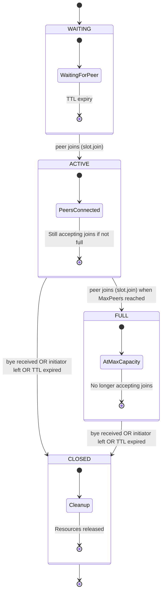

# Domain Concepts

gmmff revolves around several core domain concepts that enable secure peer-to-peer communication:

## Session

A **session** represents a peer-to-peer file and message transfer session between two or more peers. A session is established when peers share a secret code and successfully complete the PAKE authentication and WebRTC handshake.

Key characteristics:
- Ephemeral: exists only for the duration of the peer connection
- Secure: all data transferred is encrypted end-to-end
- Multi-peer: supports 2-10 peers in a single session
- Interactive: provides a REPL for sending files and messages

## Slot

A **slot** is the server-side representation of a session waiting for peers to join. It lives in the signaling server's storage (Redis/Valkey or in-memory map) and tracks the state of peers attempting to establish a session.

Slot lifecycle:
1. **WAITING**: Created by first peer (`gmmff create`), waiting for peers
2. **ACTIVE**: At least one peer has joined (initiator + N peers), still accepting joins if not full
3. **FULL**: Maximum peers reached (MaxPeers), no longer accepting new joins
4. **CLOSED**: Session ended (peer disconnected, initiator left, or TTL expired)

Slot structure:
- ID: Unique identifier for the slot
- Code: The 3-word secret code used for PAKE
- State: Current state (WAITING, ACTIVE, FULL, CLOSED)
- CreatedAt: Timestamp when slot was created
- ExpiresAt: Timestamp when slot expires (10 minutes after creation)
- InitiatorID: WebSocket connection ID of the peer that created the slot
- PeerIDs: WebSocket connection IDs of joined peers (not including initiator)
- MaxPeers: Total number of participants allowed (initiator counts as 1)
- EverFull: Set to true the first time slot reaches MaxPeers; once true, slot stays closed even if peers leave

## PAKE (Password Authenticated Key Exchange)

**PAKE** is the cryptographic protocol that allows two peers to establish a shared secret over an insecure channel (the signaling server) without revealing the secret to the server.

gmmff uses the **CPace** protocol:
- Input: low-entropy secret (the 3-word code)
- Output: strong shared secret key
- Properties:
  - Mutual authentication: both peers verify they know the same secret
  - Key derivation: generates cryptographic keys for subsequent encryption
  - Server oblivious: server sees only protocol messages, cannot derive secret
  - Resistant to offline dictionary attacks

The PAKE secret is used to:
1. Derive keys for HMAC-signing SDP messages (prevents MITM)
2. Seed the key derivation for WebRTC/DTLS encryption

### PAKE Handshake and WebRTC Authentication
The PAKE exchange establishes a shared secret `S` that authenticates the WebRTC connection:
- After PAKE, peers exchange SDP offers/answers HMAC-signed with `S` over the signaling channel
- Each peer verifies the HMAC using `S` to ensure the other party knows the secret
- The shared secret `S` is also used via HKDF to derive keys for the DTLS 1.3 handshake
- DTLS 1.3 provides mutual authentication and encryption for the WebRTC data channel
- This creates an authenticated, encrypted channel where the signaling server cannot tamper with SDP/ICE messages

## WebRTC Data Channel

Once peers have established a shared secret via PAKE, they establish a direct **WebRTC data channel** for transferring files and messages.

Key properties:
- **Peer-to-peer**: data flows directly between peers after initial signaling
- **Encrypted**: DTLS 1.3 provides encryption and authentication
- **Ordered/Unordered**: can configure reliability per channel
- **Congestion controlled**: uses UDP-based congestion control (similar to TCP)
- **Message-oriented**: preserves message boundaries (unlike byte streams)

gmmff uses:
- **DTLS 1.3** for encryption (standard WebRTC security)
- **SCTP over DTLS** for data transport
- **Partial reliability** for file transfers (retransmits lost packets)
- **Unreliable** for chat messages (low latency, occasional loss acceptable)

### Chat Feature
Messages are exchanged over the WebRTC data channel using a simple symmetric protocol:
- Each message is prefixed with a one-byte tag indicating message type
- `TagMessage`: normal text message from any participant
- `TagChatClose`: initiator ends the session for everyone
- `TagParticipantLeave`: one participant leaves quietly; session continues
- `TagCancelled`: connection-level cancel (treated as `TagChatClose`)
- The chat session manages idle timeouts (10 minutes of inactivity) and handles CLI quit commands (`\q` for initiator to close session, `Ctrl+C` for quiet leave)
- Messages are transmitted as UTF-8 strings, preserving message boundaries via SCTP

## Schedule Feature

The **schedule** feature enables delayed file transfers with client-side encryption:
- Files are encrypted client-side using AES-256-GCM with a random key
- Encrypted file chunks are stored on the server pending retrieval
- A shareable URL contains the file ID and decryption key fragment (after `#`)
- The server stores encrypted files until TTL expires or download limit is reached
- Server-side cleanup removes expired files based on configured intervals
- Clients download encrypted chunks and decrypt locally using the key from the URL
- The schedule feature is mounted at `/api/schedule/` on the signaling server when enabled

### Storage and Triggering
- Uploads are split into chunks, encrypted, and stored in a pending directory
- Metadata tracks upload progress (chunks written/total) and expiration
- Once all chunks are uploaded, the file is moved to a complete directory
- Downloads retrieve encrypted chunks, decrypt them, and reassemble the file
- Expiration and download limits are enforced at download time
- Background cleanup processes remove expired files based on cron expressions

## Cryptographic Flow

1. **PAKE Exchange** (via signaling server)
   - Peer A: `pake1` → Server → Peer B
   - Peer B: `pake2` → Server → Peer A
   - Result: Both derive shared secret `S`

2. **SDP Exchange** (HMAC-signed with `S`)
   - Peer A: `sdp1 = offer || HMAC_S(offer)` → Server → Peer B
   - Peer B: `sdp2 = answer || HMAC_S(answer)` → Server → Peer A
   - Verification: Each peer verifies HMAC using `S`

3. **ICE Exchange** (not HMAC-signed, but integrity protected by DTLS)
   - Peer A: `ice1` → Server → Peer B
   - Peer B: `ice2` → Server → Peer A

4. **DTLS Handshake** (uses keys derived from `S` via HKDF)
   - Establishes encrypted SRTP/SCTP associations using **DTLS 1.3**
   - Provides mutual authentication and perfect forward secrecy

5. **SCTP Data Channel** (application data)
   - File transfer and messaging over encrypted channel
   - Uses **HKDF** to derive session keys from the PAKE secret

## Crypto Constraints
- **DTLS 1.3** is required for WebRTC encryption
- **HKDF** is used for key derivation from the PAKE secret
- **HMAC** (with SHA-256) signs SDP messages for integrity
- **AES-256-GCM** encrypts scheduled file uploads
- **CPace** PAKE protocol resists offline dictionary attacks
- All cryptographic operations use constant-time implementations where possible

## Slot State Machine

The slot lifecycle is managed by a strict state machine to prevent invalid states:

```mermaid
stateDiagram-v2
    [*] --> WAITING
    WAITING --> ACTIVE: peer joins (slot.join)
    ACTIVE --> FULL: peer joins (slot.join) when MaxPeers reached
    ACTIVE --> CLOSED: bye received OR initiator left OR TTL expired
    FULL --> CLOSED: bye received OR initiator left OR TTL expired
    CLOSED --> [*]
    
    state WAITING {
        [*] --> WaitingForPeer
        WaitingForPeer --> [*]: TTL expiry
    }
    
    state ACTIVE {
        [*] --> PeersConnected
        PeersConnected --> [*]: Still accepting joins if not full
    }
    
    state FULL {
        [*] --> AtMaxCapacity
        AtMaxCapacity --> [*]: No longer accepting joins
    }
    
    state CLOSED {
        [*] --> Cleanup
        Cleanup --> [*]: Resources released
    }
```

State transitions are validated in `internal/slot/slot.go` before any storage write, ensuring the signaling server never persists invalid state.
