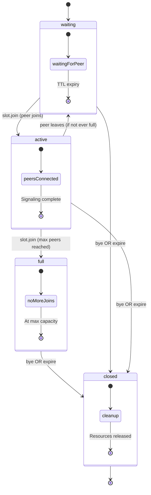

# Domain Concepts Overview

## Core Concepts

gmmff revolves around several core domain concepts that enable secure peer-to-peer communication:

### Session

A **session** represents a peer-to-peer file and message transfer session between two or more peers. A session is established when peers share a secret code and successfully complete the PAKE authentication and WebRTC handshake.

Key characteristics:
- Ephemeral: exists only for the duration of the peer connection
- Secure: all data transferred is encrypted end-to-end
- Multi-peer: supports 2-10 peers in a single session
- Interactive: provides a REPL for sending files and messages

### Slot

A **slot** is the server-side representation of a session waiting for peers to join. It lives in the signaling server's storage (Redis/Valkey or in-memory map) and tracks the state of peers attempting to establish a session.

Slot lifecycle:
1. **waiting**: Created by first peer (`gmmff create`), waiting for peers to join
2. **active**: At least one peer has joined, still accepting new peers if not full
3. **full**: Maximum number of peers reached, no longer accepting new joins
4. **closed**: Session ended (peer disconnected, initiator left, or TTL expired)

Slot structure:
- ID: Unique identifier for the slot
- Code: The 3-word secret code used for PAKE
- State: Current state (waiting, active, full, closed)
- SessionType: Type of session (e.g., "default")
- CreatedAt: Timestamp when slot was created
- ExpiresAt: Timestamp when slot expires (10 minutes after creation)
- InitiatorID: WebSocket connection ID of the peer that created the slot
- PeerIDs: List of WebSocket connection IDs of joined peers (not including initiator)
- MaxPeers: Maximum number of participants allowed (initiator counts as 1)
- EverFull: Boolean set to true when slot first reaches MaxPeers; prevents rejoining after leaving

Slot behavior:
- A slot starts in waiting state with only the initiator connected
- When a peer joins via `gmmff join`, the slot transitions to active
- If the slot reaches MaxPeers, it transitions to full and sets EverFull=true
- If a peer leaves and EverFull=false, the slot may return to waiting or active
- If EverFull=true, the slot remains full even after peers leave
- Slots transition to closed when expired, initiator disconnects, or explicit bye is received

### PAKE (Password Authenticated Key Exchange)

**PAKE** is the cryptographic protocol that allows two peers to establish a shared secret over an insecure channel (the signaling server) without revealing the secret to the server.

gmmff uses the **CPace** protocol:
- Input: low-entropy secret (the 3-word code)
- Output: strong shared secret key
- Properties:
  - Mutual authentication: both peers verify they know the same secret
  - Key derivation: generates cryptographic keys for subsequent encryption
  - Server oblivious: server sees only protocol messages, cannot derive secret
  - Resistant to offline dictionary attacks

After CPace completes, both peers hold the same shared secret (S). From S, two subkeys are derived using HKDF-SHA256 with distinct info labels:
- offerKey  = HKDF(S, salt="gmmff-v1", info="sdp-offer-mac")
- answerKey = HKDF(S, salt="gmmff-v1", info="sdp-answer-mac")

The initiator signs the SDP offer with offerKey and verifies the answer with answerKey.
The responder signs the SDP answer with answerKey and verifies the offer with offerKey.

These HMACs prevent a compromised signaling server from substituting its own SDP fingerprints.

### WebRTC Data Channel

Once peers have established a shared secret via PAKE, they establish a direct **WebRTC data channel** for transferring files and messages.

Key properties:
- **Peer-to-peer**: data flows directly between peers after initial signaling
- **Encrypted**: DTLS 1.2+ provides encryption and authentication
- **Ordered/Unordered**: can configure reliability per channel
- **Congestion controlled**: uses UDP-based congestion control (similar to TCP)
- **Message-oriented**: preserves message boundaries (unlike byte streams)

gmmff uses:
- **DTLS-SRTP** for encryption (standard WebRTC security)
- **SCTP over DTLS** for data transport
- **Partial reliability** for file transfers (retransmits lost packets)
- **Unreliable** for chat messages (low latency, occasional loss acceptable)

### Slot State Machine

The slot lifecycle is managed by a strict state machine to prevent invalid states:

```mermaid
stateDiagram-v2
    [*] --> waiting
    waiting --> active: slot.join (peer joins)
    active --> full: slot.join (max peers reached)
    active --> waiting: peer leaves (if not ever full)
    full --> closed: bye OR expire
    waiting --> closed: bye OR expire
    active --> closed: bye OR expire
    closed --> [*]
    
    state waiting {
        [*] --> waitingForPeer
        waitingForPeer --> [*]: TTL expiry
    }
    
    state active {
        [*] --> peersConnected
        peersConnected --> [*]: Signaling complete
    }
    
    state full {
        [*] --> noMoreJoins
        noMoreJoins --> [*]: At max capacity
    }
    
    state closed {
        [*] --> cleanup
        cleanup --> [*]: Resources released
    }
```

State transitions are validated in `internal/slot/slot.go` before any storage write, ensuring the signaling server never persists invalid state.

### Cryptographic Flow

1. **PAKE Exchange** (via signaling server)
   - Peer A: `pake1` → Server → Peer B
   - Peer B: `pake2` → Server → Peer A
   - Result: Both derive shared secret `S`

2. **Key Derivation** (from shared secret `S`)
   - offerKey  = HKDF(S, salt="gmmff-v1", info="sdp-offer-mac")
   - answerKey = HKDF(S, salt="gmmff-v1", info="sdp-answer-mac")

3. **SDP Exchange** (HMAC-signed with derived keys)
   - Peer A signs offer with offerKey: `sdp1 = offer || HMAC_offerKey(offer)` → Server → Peer B
   - Peer B signs answer with answerKey: `sdp2 = answer || HMAC_answerKey(answer)` → Server → Peer A
   - Verification: Each peer verifies HMAC using the appropriate derived key

4. **ICE Exchange** (not HMAC-signed, but integrity protected by DTLS)
   - Peer A: `ice1` → Server → Peer B
   - Peer B: `ice2` → Server → Peer A

5. **DTLS Handshake** (uses keys derived from `S`)
   - Establishes encrypted SRTP/SCTP associations

6. **SCTP Data Channel** (application data)
   - File transfer and messaging over encrypted channel

## Key Source Files by Concept

### Session Management
- `cmd/gmmff/create.go` - `gmmff create` command
- `cmd/gmmff/join.go` - `gmmff join` command
- `cmd/gmmff/chat.go` - `gmmff chat` command
- `internal/session/session.go` - Core session logic
- `internal/session/session_test.go` - Session tests

### Slot Management
- `internal/slot/slot.go` - Slot struct and state transitions
- `internal/slot/slot_test.go` - Slot tests
- `internal/store/` - Storage abstractions (Redis, memory)

### PAKE/Cryptography
- `internal/pake/` - CPace implementation
- `internal/crypto/` - HKDF, HMAC, and key derivation
- `internal/protocol/` - Protocol message definitions and HMAC signing

### WebRTC/P2P
- `internal/peer/` - Peer connection management
- `internal/transfer/` - File transfer over data channels
- `internal/chat/` - Chat messaging over data channels

### Storage
- `internal/store/memory.go` - In-memory store (dev)
- `internal/store/redis.go` - Redis/Valkey store
- `internal/store/store.go` - Storage interface

## Related Concepts

### Configuration
- Environment variables (see `docs/ENV.md`)
- Command-line flags (see `docs/CMDS.md`)
- Configuration validation (`internal/conf/`)

### Error Handling
- Error types (`internal/err/` context wrapping)
- Context-aware logging (`internal/log/`)

### Metrics
- Prometheus metrics (`internal/metrics/`)
- Health checks (`/healthz`, `/readyz` endpoints)

## Domain Boundaries

### Bounded Contexts

1. **Signaling Context** (`internal/broker/`, `internal/signaling/`, `internal/slot/`, `internal/store/`)
   - Responsible for brokering initial peer connections
   - Manages slot lifecycle and state
   - Never sees file contents or decryption keys

2. **Peer Connection Context** (`internal/peer/`, `internal/transfer/`, `internal/chat/`)
   - Handles WebRTC connection establishment
   - Manages data channels for file/messages transfer
   - Handles encryption via keys derived from PAKE

3. **Cryptographic Context** (`internal/pake/`, `internal/crypto/`)
   - Implements PAKE (CPace) for key establishment
   - Provides cryptographic primitives (HKDF, HMAC)
   - Handles SDP message signing

4. **Application Context** (`cmd/gmmff/`, `internal/session/`)
   - CLI command implementations
   - Session REPL and user interaction
   - File system interaction (reading/writing files)

## Data Flow Summary

1. **Session Initiation**
   - User runs `gmmff create` → creates slot in storage → gets 3-word code
   - User shares code out-of-band

2. **Peer Joining**
   - Peer runs `gmmff join <code>` → resolves code to slot UUID
   - Both peers now connected to signaling server

3. **Key Establishment**
   - PAKE exchange via signaling server → shared secret established
   - SDP exchange (HMAC-signed with secret) → WebRTC parameters agreed
   - ICE exchange → network path established

4. **Direct Connection**
   - Signaling server's job is complete
   - Peers establish encrypted WebRTC data channel directly
   - All subsequent file/message transfer is peer-to-peer

5. **Session Interaction**
   - Users send files/messages via session REPL
   - Data transferred directly over encrypted channel
   - Session ends when peers disconnect or TTL expires

## See Also

<!-- openwiki: broken internal link [/openwiki/architecture/overview.md] link "/openwiki/architecture/overview.md" is root-absolute, which no real consumer resolves against the repository root (not a coding agent reading the page, not GitHub's Markdown renderer, not a local viewer); use a path relative to this file instead. Fix the href or restore the target, then delete this comment. -->
- [Architecture Overview](/openwiki/architecture/overview.md) - System components and deployment
<!-- openwiki: broken internal link [/openwiki/workflows/key-workflows.md] link "/openwiki/workflows/key-workflows.md" is root-absolute, which no real consumer resolves against the repository root (not a coding agent reading the page, not GitHub's Markdown renderer, not a local viewer); use a path relative to this file instead. Fix the href or restore the target, then delete this comment. -->
- [Key Workflows](/openwiki/workflows/key-workflows.md) - Step-by-step walkthroughs of common operations
<!-- openwiki: broken internal link [/openwiki/source-map.md] link "/openwiki/source-map.md" is root-absolute, which no real consumer resolves against the repository root (not a coding agent reading the page, not GitHub's Markdown renderer, not a local viewer); use a path relative to this file instead. Fix the href or restore the target, then delete this comment. -->
- [Source Map](/openwiki/source-map.md) - Direct mapping of concepts to source files
<!-- openwiki: broken internal link [/openwiki/operations/runbook.md] link "/openwiki/operations/runbook.md" is root-absolute, which no real consumer resolves against the repository root (not a coding agent reading the page, not GitHub's Markdown renderer, not a local viewer); use a path relative to this file instead. Fix the href or restore the target, then delete this comment. -->
- [Operations & Runbook](/openwiki/operations/runbook.md) - Deployment, configuration, and maintenance
