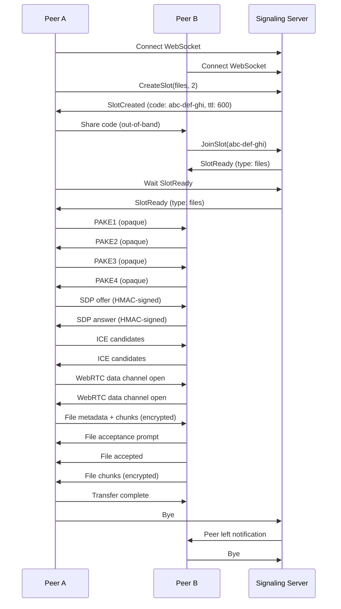
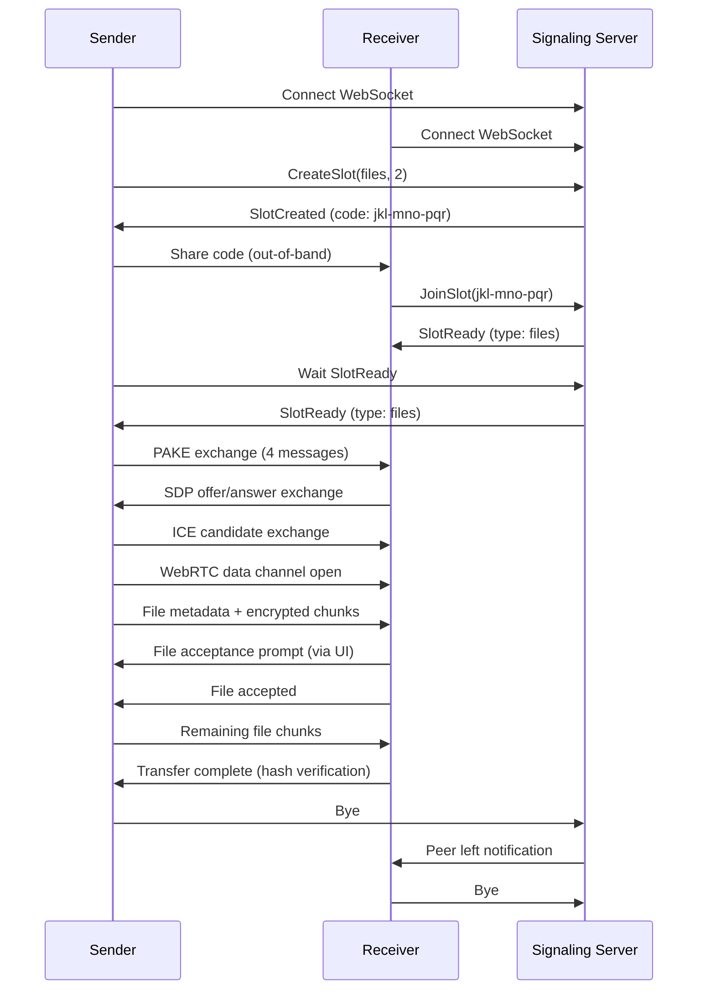
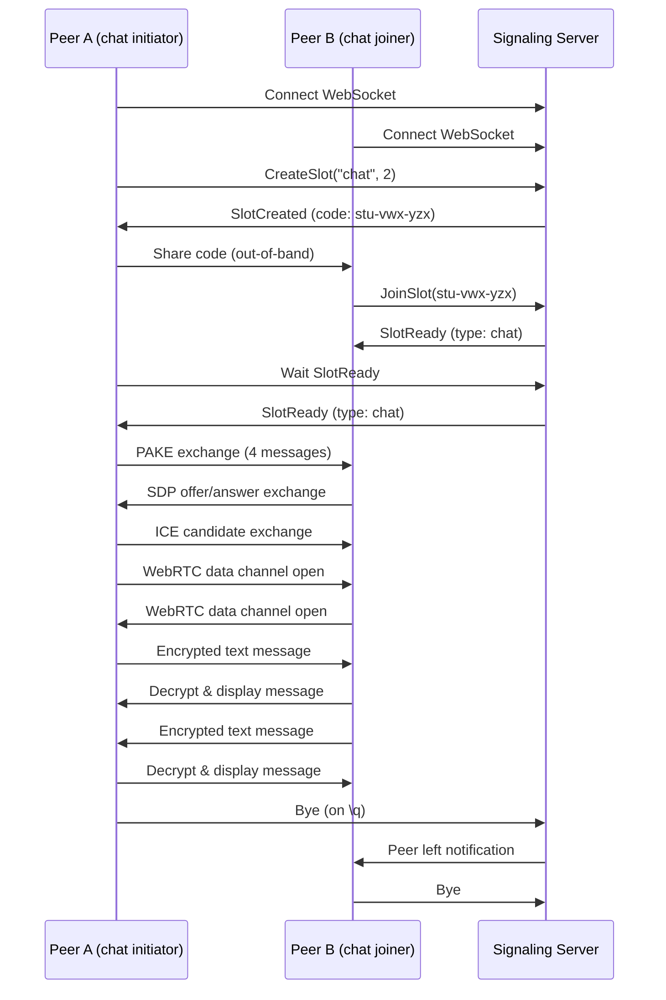
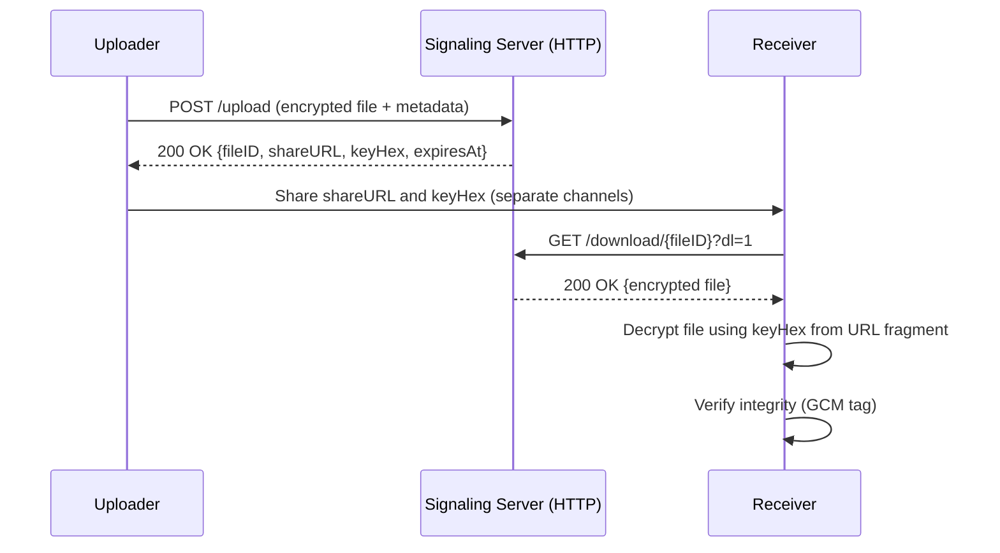

# Key Workflows

## Interactive File Transfer Session

The most common workflow involves two peers establishing a session to transfer files and messages bidirectionally.

### User-Facing Steps

1. **Peer A initiates session**
   ```bash
   gmmff create
   # Output: Created session: abc-def-ghi
   #         Share this code with your peer: apple-banana-cherry
   ```

2. **Peer A shares code**  
   Peer A communicates the 3-word code (`apple-banana-cherry`) to Peer B via an out-of-band channel (verbal, QR code, etc.)

3. **Peer B joins session**
   ```bash
   gmmff join apple-banana-cherry
   ```

4. **Session establishment** (internal)
   - Both peers connect to the signaling server
   - Server resolves code → slot UUID
   - Peers exchange PAKE messages to derive shared key
   - SDP offer/answer exchanged (HMAC-signed with PAKE secret)
   - ICE candidates exchanged to establish direct connection
   - WebRTC data channel opens
   - Signaling server's role is complete

5. **Session REPL active**
   Both peers see:
   ```
   gmmff> 
   ```
   Available commands:
   - `send <file|dir>` - Send file(s) or directory
   - `msg <message>` - Send a chat message
   - `peers` - List connected peers
   - `exit` - Leave session

6. **File transfer**
   - Peer A: `send document.pdf`
   - File is chunked, encrypted, and sent over WebRTC data channel
   - Progress bar shows transfer progress
   - Receiver gets prompt: `Accept document.pdf? [y/N]`
   - On acceptance, file is verified via hash and saved

7. **Session termination**
   - Either peer types `exit` or presses Ctrl+C
   - Peer sends `bye` frame to signaling server
   - Server deletes slot keys, notifies remaining peer
   - WebRTC connection closes

### Internal Signaling Flow (Mermaid)


## One-off File Transfer (`gmmff send`)

For simple file transfers without interactive REPL:

### User-Facing Steps

```bash
# Peer A (sender)
gmmff send document.pdf --message "Here's the document"
# Output: Created session: jkl-mno-pqr
#         Share this code with your peer: dog-cat-bird
#         Waiting for peer...
#         Peer connected!
#         Sending document.pdf (1.2 MB)...
#         Transfer complete and verified.

# Peer B (receiver)
gmmff join dog-cat-bird
# Accept document.pdf? [y/N] y
# Receiving document.pdf (1.2 MB)...
# Transfer complete.
# Session ended.
```

### Internal Behavior
1. Creates a session with slot type "files" and max peers 2
2. Waits for exactly one peer to join (slot.ready)
3. Streams file(s) over WebRTC data channel:
   - Single file: streams directly from disk
   - Multiple files/directory: creates in-memory zip stream
4. Attaches optional message to transfer
5. Verifies transfer via SHA-256 hash
6. Automatically exits after verification

### Internal Signaling Flow (Mermaid)


## Chat Session

For pure text communication:

### User-Facing Steps

```bash
# Peer A
gmmff chat
# Output: Created session: stu-vwx-yzx
#         Share this code with your peer: red-green-blue
#         Waiting for peer...

# Peer B
gmmff chat red-green-blue
# Connected! Type messages to send.

# Both peers see:
# Peer A: Hello!
# Peer B: Hi there!
```

### Internal Behavior
1. Creates a session with slot type "chat"
2. Waits for peer to join via `gmmff join <code>`
3. Establishes WebRTC data channel for text only
4. Messages sent directly over data channel
5. Session ends when either peer types `\q` or connection is lost
6. No file transfer capabilities

### Internal Signaling Flow (Mermaid)


## Local-Network Mode (`gmmff local`)

For environments without internet access:

### User-Facing Steps

```bash
# On Peer A
gmmff local
# Output: mDNS service registered: _gmmff._tcp.local.
#         Local server listening on :12345
#         Visit http://[::1]:12345 in your browser
#         or run: gmmff local --no-tls --port 12345

# On Peer B (same network)
gmmff local
# Automatically discovers Peer A via mDNS
# Can connect via browser or another gmmff local instance
```

### Internal Behavior
1. Starts embedded signaling server (WebSocket + HTTP)
2. Registers mDNS service `_gmmff._tcp.local.`
3. Serves browser UI at `http://<local-ip>:<port>`
4. Uses host candidates only for WebRTC (no STUN/TURN)
5. Optional self-signed TLS (disable with `--no-tls`)
6. All components run in single process
7. Supports file transfer and chat like normal mode

### Components Interaction (Mermaid)
```mermaid
graph TD
    A[gmmff local Process] --> B[Embedded Signaling Server]
    A --> C[mDNS Responder]
    A --> D[HTTP Server (Browser UI)]
    A --> E[WebRTC Peer Connection]
    
    B -->|WebSocket| F[Peer A Browser/UI]
    B -->|WebSocket| G[Peer B gmmff local]
    C -->|mDNS| G
    D -->|HTTP| F
    D -->|HTTP| G
    E -->|WebRTC Data Channel| F
    E -->|WebRTC Data Channel| G
    
    style A fill:#f9f,stroke:#333
```

## Schedule Mode (Encrypted Server-Side Transfers)

For scheduled, server-mediated transfers:

### User-Facing Steps

```bash
# Schedule an upload
gmmff schedule upload --local-path ./backup.zip --remote-path backups/weekly.zip --recur "@weekly"

# Schedule a download
gmmff schedule download --remote-path backups/weekly.zip --local-path ./latest.zip --recur "@daily"
```

### Internal Behavior
1. Client encrypts file with AES-256-GCM using random key
2. Uploads ciphertext to signaling server via HTTPS
3. Server returns share URL containing file ID
4. Decryption key stored in URL fragment (`#key=...`) - never sent to server
5. Recipient downloads ciphertext and decrypts locally using key from fragment
6. Supports TTL, max-downloads, password protection
7. Multiple files/directories zipped before encryption

### Upload Flow (Mermaid)


## Configuration & Environment

All services configure via environment variables (prefixed with `GMMFF_`):

```bash
# Essential for production
GMMFF_REDIS_URL=redis://localhost:6379
GMMFF_SERVER=ws://signaling.example.com/ws

# Optional
GMMFF_LOG_LEVEL=info
GMMFF_LOG_PRETTY=true
GMMFF_STUN=stun:stun.l.google.com:19302
GMMFF_TURN=turn:turn.example.com:3478?transport=udp
```

<!-- openwiki: broken internal link [docs/ENV.md] file "docs/ENV.md" does not exist. Fix the href or restore the target, then delete this comment. -->
<!-- openwiki: broken internal link [docs/CMDS.md] file "docs/CMDS.md" does not exist. Fix the href or restore the target, then delete this comment. -->
See [Environment Variables](docs/ENV.md) and [Commands Reference](docs/CMDS.md) for full details.

## Error Handling & Troubleshooting

Common issues and solutions:

1. **Connection timeout**
   - Check network connectivity to signaling server
   - Verify STUN/TURN settings if behind NAT
   - Ensure WebSocket port (default 8080) is accessible

2. **Session expired**
   - Codes expire after 10 minutes
   - Create a new session if joining takes too long

3. **Authentication failure**
   - Verify both peers entered identical code
   - Check for typos in 3-word code
   - Ensure no extra whitespace

4. **WebRTC connection failed**
   - Try different STUN/TURN servers
   - Check firewall rules blocking UDP/TCP ports
   - Use `--no-tls` in local mode for browser compatibility

See [Operations & Runbook](/openwiki/operations/runbook.md) for detailed troubleshooting.
