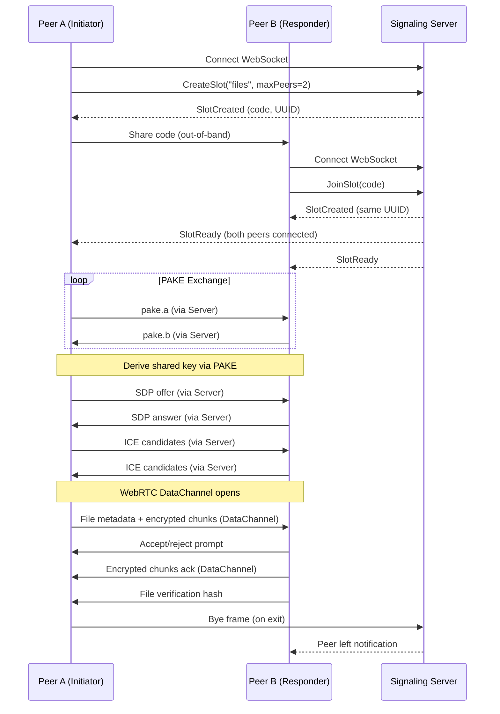

# Key Workflows

## File Transfer Session

The most common workflow involves two peers establishing a session to transfer files and messages.

### Step-by-Step Flow



#### Details

1. **Session Creation**: `gmmff create` initiates a session by connecting to the signaling server and creating a slot with a 3-word code.
2. **Code Exchange**: The initiator shares the code out-of-band; the responder uses `gmmff join <code>` to connect.
3. **Authentication**: Both peers perform a Password-Authenticated Key Exchange (PAKE) to derive a shared secret without transmitting the password.
4. **WebRTC Setup**: Using the shared secret to sign SDP messages, peers exchange offers/answers and ICE candidates to establish a direct connection.
5. **Data Channel**: A WebRTC data channel is opened for encrypted file transfer and messaging.
6. **File Transfer**: Files are chunked, encrypted, and transferred. The receiver verifies the hash before accepting.
7. **Session End**: Either peer can exit, triggering cleanup on the signaling server.

### One-off File Transfer (`gmmff send`)

For simple file transfers without interactive REPL:

```bash
# Peer A
gmmff send document.pdf --message "Here's the document"
# Output: Created session: jkl-mno-pqr
#         Share this code with your peer: dog-cat-bird
#         Waiting for peer...
#         Peer connected!
#         Sending document.pdf (1.2 MB)...
#         Transfer complete and verified.
```

Peer B runs:
```bash
gmmff join dog-cat-bird
# Accept document.pdf? [y/N] y
# Receiving document.pdf (1.2 MB)...
# Transfer complete.
# Session ended.
```

The `send` command:
1. Creates a session
2. Waits for exactly one peer to join
3. Sends the specified file(s)
4. Verifies transfer via hash
5. Automatically exits

## Chat Session

For pure text communication:

```bash
# Peer A
gmmff chat
# Output: Created session: stu-vwx-yzx
#         Share this code with your peer: red-green-blue
#         Waiting for peer...

# Peer B
gmmff chat red-green-blue
# Connected! Type messages to send.

# Both peers see:
# Peer A: Hello!
# Peer B: Hi there!
```

### How Chat Works

Chat messages are transmitted over the same WebRTC data channel used for file transfer after the session is established. The `chat` command follows the same initial connection flow as `create` but configures the session for text-only interaction. Once the data channel is open, text messages are sent as binary frames and displayed in the peer's REPL.

## Cleanup Workflow

Expired slots and schedules are removed to prevent resource exhaustion.

### Schedule Cleanup

The `gmmff cleanup` command (or background cleanup triggered by `GMMFF_SCHEDULE_CLEANUP_INTERVAL`) removes:
- Completed uploads past their expiry time (TTL)
- Completed uploads with zero remaining downloads
- Pending (in-progress) uploads older than 24 hours

This is implemented in `internal/schedule/cleanup.go` via `RunCleanup` which calls `Store.CleanExpired()`.

### Signaling Slot Cleanup

Slots (chat/file transfer sessions) expire automatically after their TTL (default 10 minutes) if no peer joins. The signaling server deletes slot keys upon expiry or when both peers disconnect.

## Schedule Workflow

For scheduled, server-mediated transfers (encrypted dead-drop):

```bash
# Schedule an upload
gmmff schedule upload --local-path ./backup.zip --remote-path backups/weekly.zip --recur "@weekly"

# Schedule a download
gmmff schedule download --remote-path backups/weekly.zip --local-path ./latest.zip --recur "@daily"
```

### Upload Flow

1. **Encryption**: Files are encrypted with AES-256-GCM using a random key.
2. **Upload**: Ciphertext is uploaded to the server via HTTPS.
3. **Key Separation**: The decryption key is returned separately and must be conveyed out-of-band (e.g., via QR code, separate message).
4. **Share URL**: The server returns a share URL containing only the file ID; the key resides in the URL fragment (`#key=...`) which is never sent to the server.
5. **Metadata**: Server stores file ID, ciphertext, TTL, and download limits.

### Download Flow

1. **Fetch**: Recipient downloads the ciphertext from the share URL.
2. **Decryption**: Using the key from the URL fragment (processed locally, not sent to server), the file is decrypted with AES-256-GCM.
3. **Output**: Decrypted content is written to disk or stdout.

The schedule handler (`internal/schedule/handler.go`) manages upload/download endpoints, encryption, and TTL enforcement. Background cleanup removes expired files.
