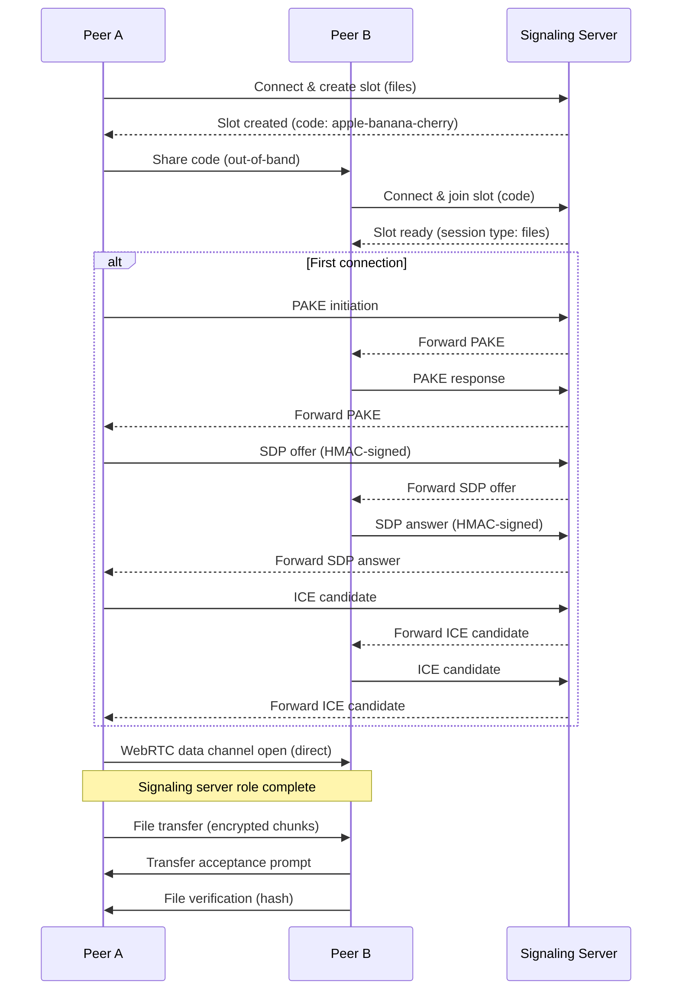

# Key Workflows

## File Transfer Session

The most common workflow involves two peers establishing a session to transfer files and messages.

### Step-by-Step Flow


```mermaid
sequenceDiagram
    participant A as Peer A
    participant B as Peer B
    participant S as Signaling Server
    
    A->>S: Connect & create slot (files)
    S-->>A: Slot created (code: apple-banana-cherry)
    A->>B: Share code (out-of-band)
    B->>S: Connect & join slot (code)
    S-->>B: Slot ready (session type: files)
    alt First connection
        A->>S: PAKE initiation
        S-->>B: Forward PAKE
        B->>S: PAKE response
        S-->>A: Forward PAKE
        A->>S: SDP offer (HMAC-signed)
        S-->>B: Forward SDP offer
        B->>S: SDP answer (HMAC-signed)
        S-->>A: Forward SDP answer
        A->>S: ICE candidate
        S-->>B: Forward ICE candidate
        B->>S: ICE candidate
        S-->>A: Forward ICE candidate
    end
    A->>B: WebRTC data channel open (direct)
    Note over A,B: Signaling server role complete
    A->>B: File transfer (encrypted chunks)
    B->>A: Transfer acceptance prompt
    B->>A: File verification (hash)
```

1. **Peer A initiates session**
   ```bash
   gmmff create
   # Output: Created session: abc-def-ghi
   #         Share this code with your peer: apple-banana-cherry
   ```

2. **Peer A shares code**  
   Peer A communicates the 3-word code (`apple-banana-cherry`) to Peer B via an out-of-band channel (verbal, QR code, etc.)

3. **Peer B joins session**
   ```bash
   gmmff join apple-banana-cherry
   ```

4. **Session establishment** (handled automatically)
   - Both peers connect to the signaling server
   - Server resolves code → slot UUID
   - Peers exchange PAKE messages to derive shared key
   - SDP offer/answer exchanged (HMAC-signed with PAKE secret)
   - ICE candidates exchanged to establish direct connection
   - WebRTC data channel opens
   - Signaling server's role is complete

5. **Session REPL active**
   Both peers see:
   ```
   > 
   ```
   Available commands:
   - `send <file|dir> [file|dir ...]` - Send file(s) or directory
   - `message <text>` - Send a chat message
   - `chat` - Open interactive chat sub-session
   - `\q` - End session for everyone (if initiator) or leave session (if not)
   - *(Multi-peer sessions show participant count updates automatically)*

6. **File transfer**
   - Peer A: `send document.pdf`
   - File is chunked, encrypted, and sent over WebRTC data channel
   - Progress bar shows transfer progress
   - Receiver gets prompt: `Accept document.pdf? [y/N]`
   - On acceptance, file is verified via hash and saved

7. **Session termination**
   - Either peer types `\q` or presses Ctrl+C
   - Peer sends `bye` frame to signaling server
   - Server deletes slot keys, notifies remaining peer
   - WebRTC connection closes

### One-off File Transfer (`gmmff send`)

For simple file transfers without interactive REPL:

```bash
# Peer A
gmmff send document.pdf --message "Here's the document"
# Output: Created session: jkl-mno-pqr
#         Share this code with your peer: dog-cat-bird
#         Waiting for peer...
#         Peer connected!
#         Sending document.pdf (1.2 MB)...
#         Transfer complete and verified.
```

Peer B runs:
```bash
gmmff join dog-cat-bird
# Accept document.pdf? [y/N] y
# Receiving document.pdf (1.2 MB)...
# Transfer complete.
# Session ended.
```

The `send` command:
1. Creates a session (slot type: files, max peers: 2)
2. Waits for exactly one peer to join
3. Sends the specified file(s) (with optional message)
4. Verifies transfer via SHA-256 hash
5. Automatically exits after transfer completion

### Chat Session

For pure text communication:

```bash
# Peer A
gmmff chat
# Output: Created session: stu-vwx-yzx
#         Share this code with your peer: red-green-blue
#         Waiting for peer...

# Peer B
gmmff chat red-green-blue
# Connected! Type messages to send.

# Both peers see:
# Peer A: Hello!
# Peer B: Hi there!
```

The `chat` command:
1. Creates a session (slot type: chat, max peers: 2)
2. Waits for the other party to connect
3. Enables bidirectional text messaging
4. Session ends when either party types `\q`, connection is lost, or no activity for 10 minutes

## Local-Network Mode (`gmmff local`)

For environments without internet access:

```bash
# On Peer A
gmmff local
# Output: mDNS service registered: _gmmff._tcp.local.
#         Local server listening on :12345
#         Visit http://[::1]:12345 in your browser
#         or run: gmmff local --no-tls --port 12345

# On Peer B (same network)
gmmff local
# Automatically discovers Peer A via mDNS
# Can connect via browser or another gmmff local instance
```

Features:
- Embedded signaling server (WebSocket + HTTP)
- mDNS-based peer discovery
- Optional self-signed TLS (disable with `--no-tls`)
- Browser-accessible UI at `http://<local-ip>:<port>`
- All components in single process
- WebRTC uses direct LAN IP addresses (host candidates only)
- No STUN/TURN servers contacted

## Schedule Mode (Encrypted Server-Side Transfers)

For scheduled, server-mediated transfers:

```bash
# Schedule an upload
gmmff schedule upload --local-path ./backup.zip --remote-path backups/weekly.zip --recur "@weekly"

# Schedule a download
gmmff schedule download --remote-path backups/weekly.zip --local-path ./latest.zip --recur "@daily"
```

The `schedule` command:
1. Encrypts files with AES-256-GCM using a random key
2. Uploads encrypted file(s) to the server
3. Returns a share URL containing the file ID
4. Returns a decryption key (kept separate from URL for security)
5. Recurring schedules use cron syntax (e.g., `@weekly`, `@daily`)

<!-- openwiki: broken internal link [docs/SCHEDULE.md] file "docs/SCHEDULE.md" does not exist. Fix the href or restore the target, then delete this comment. -->
See [Schedule Documentation](docs/SCHEDULE.md) for details.

## Configuration & Environment

All services configure via environment variables (prefixed with `GMMFF_`):

```bash
# Essential for production
GMMFF_REDIS_URL=redis://localhost:6379
GMMFF_SERVER=ws://signaling.example.com/ws

# Optional
GMMFF_LOG_LEVEL=info
GMMFF_LOG_PRETTY=true
GMMFF_STUN=stun:stun.l.google.com:19302
GMMFF_TURN=turn:turn.example.com:3478?transport=udp
```

<!-- openwiki: broken internal link [docs/ENV.md] file "docs/ENV.md" does not exist. Fix the href or restore the target, then delete this comment. -->
<!-- openwiki: broken internal link [docs/CMDS.md] file "docs/CMDS.md" does not exist. Fix the href or restore the target, then delete this comment. -->
See [Environment Variables](docs/ENV.md) and [Commands Reference](docs/CMDS.md) for full details.

## Error Handling & Troubleshooting

Common issues and solutions:

1. **Connection timeout**
   - Check network connectivity to signaling server
   - Verify STUN/TURN settings if behind NAT
   - Ensure WebSocket port (default 8080) is accessible

2. **Session expired**
   - Codes expire after 10 minutes (configurable via `GMMFF_SLOT_TTL`)
   - Create a new session if joining takes too long

3. **Authentication failure**
   - Verify both peers entered identical code
   - Check for typos in 3-word code
   - Ensure no extra whitespace

4. **WebRTC connection failed**
   - Try different STUN/TURN servers
   - Check firewall rules blocking UDP/TCP ports
   - Use `--no-tls` in local mode for browser compatibility (Safari requires HTTPS)

<!-- openwiki: broken internal link [/openwiki/operations/runbook.md] link "/openwiki/operations/runbook.md" is root-absolute, which no real consumer resolves against the repository root (not a coding agent reading the page, not GitHub's Markdown renderer, not a local viewer); use a path relative to this file instead. Fix the href or restore the target, then delete this comment. -->
See [Operations & Runbook](/openwiki/operations/runbook.md) for detailed troubleshooting.
